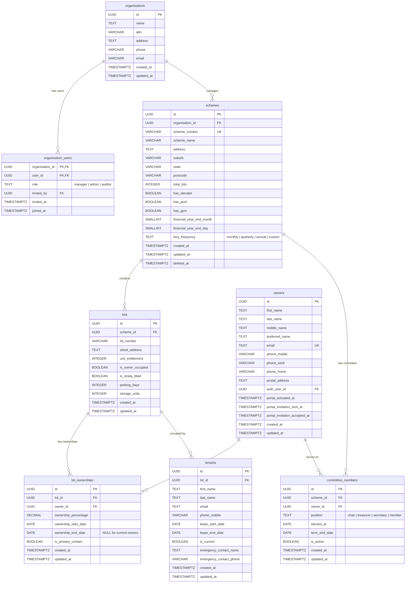

# Core Entity Relationship Diagram

Core entities covering multi-tenant organisations, strata schemes, lots, ownership, committee members, and tenants.

**Tables:** organisations, organisation_users, schemes, lots, owners, lot_ownerships, committee_members, tenants

