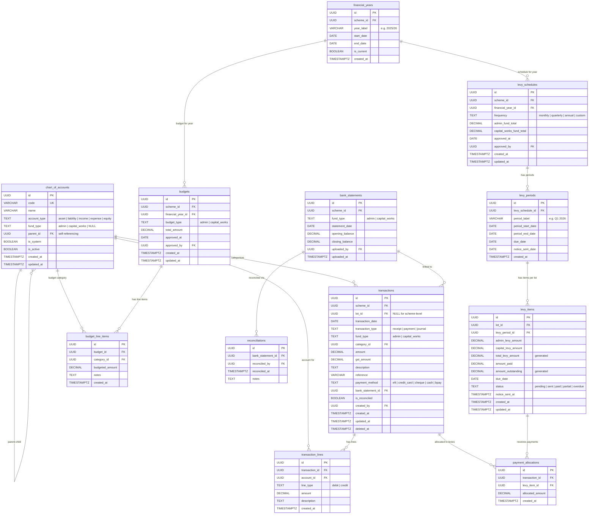

# Financial Entity Relationship Diagram

Financial entities covering trust accounting, chart of accounts, levy management, budgets, and bank reconciliation.

**Tables:** chart_of_accounts, financial_years, transactions, transaction_lines, levy_schedules, levy_periods, levy_items, payment_allocations, budgets, budget_line_items, bank_statements, reconciliations

