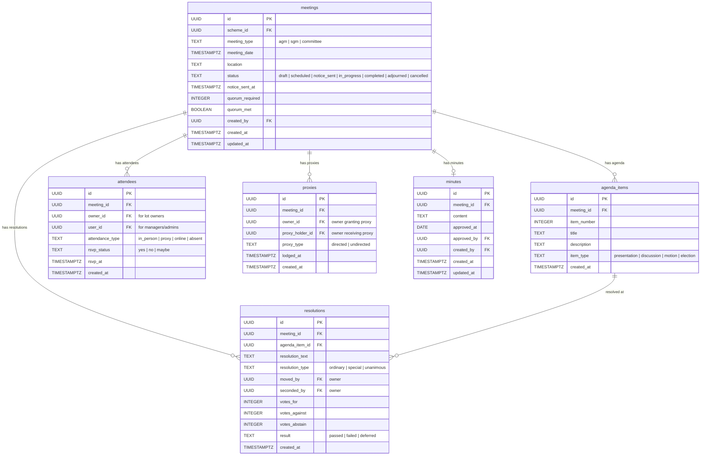

# Meetings Entity Relationship Diagram

Meeting administration entities covering AGMs, SGMs, committee meetings, agenda items, attendance, proxies, resolutions, and minutes.

**Tables:** meetings, agenda_items, attendees, proxies, resolutions, minutes

