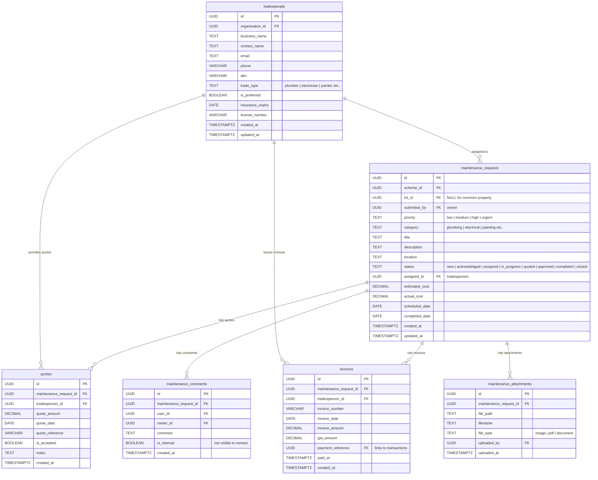

# Maintenance Entity Relationship Diagram

Maintenance management entities covering work requests, comments, tradespeople, quotes, invoices, and attachments.

**Tables:** maintenance_requests, maintenance_comments, tradespeople, quotes, invoices, maintenance_attachments

