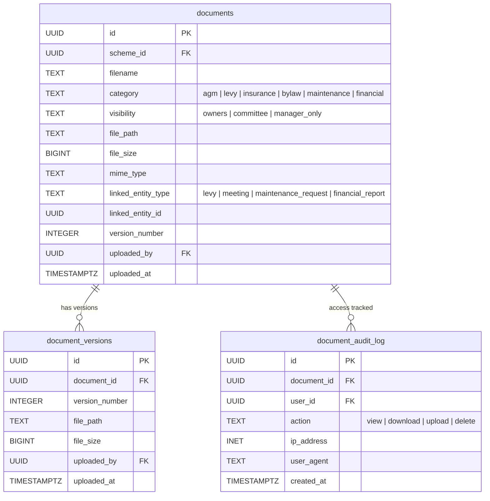

# Documents Entity Relationship Diagram

Document management entities covering document storage, versioning, and access audit logging.

**Tables:** documents, document_versions, document_audit_log

