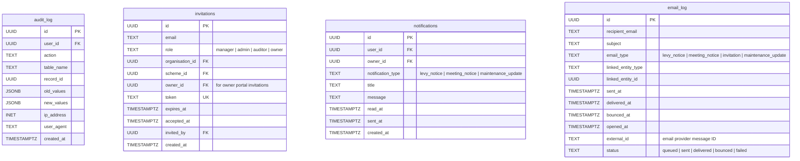

# System Entity Relationship Diagram

System-level entities covering audit logging, user invitations, notifications, and email delivery tracking.

**Tables:** audit_log, invitations, notifications, email_log

