# Entity Relationship Overview Diagram

High-level overview showing all 44 tables grouped by domain, with cross-domain relationships highlighted. Each box represents a table; lines show cross-domain foreign key relationships.

## Domain Summary

| Domain | Tables | Count |
|--------|--------|-------|
| Core | organisations, organisation_users, schemes, lots, owners, lot_ownerships, committee_members, tenants | 8 |
| Financial | chart_of_accounts, financial_years, transactions, transaction_lines, levy_schedules, levy_periods, levy_items, payment_allocations, budgets, budget_line_items, bank_statements, reconciliations | 12 |
| Meetings | meetings, agenda_items, attendees, proxies, resolutions, minutes | 6 |
| Maintenance | maintenance_requests, maintenance_comments, tradespeople, quotes, invoices, maintenance_attachments | 6 |
| Documents | documents, document_versions, document_audit_log | 3 |
| System | audit_log, invitations, notifications, email_log | 4 |
| Subscription & Billing | subscription_plans, subscriptions, usage_tracking, platform_invoices, payment_events | 5 |
| **Total** | | **44** |

## Cross-Domain Relationship Diagram

```mermaid
erDiagram
    organisations ||--o{ organisation_users : ""
    organisations ||--o{ schemes : ""
    organisations ||--o{ tradespeople : ""

    schemes ||--o{ lots : ""
    schemes ||--o{ committee_members : ""
    schemes ||--o{ financial_years : ""
    schemes ||--o{ transactions : ""
    schemes ||--o{ levy_schedules : ""
    schemes ||--o{ budgets : ""
    schemes ||--o{ bank_statements : ""
    schemes ||--o{ meetings : ""
    schemes ||--o{ maintenance_requests : ""
    schemes ||--o{ documents : ""

    lots ||--o{ lot_ownerships : ""
    lots ||--o{ tenants : ""
    lots ||--o{ levy_items : ""
    lots ||--o{ transactions : "lot-level"
    lots ||--o{ maintenance_requests : "lot-level"

    owners ||--o{ lot_ownerships : ""
    owners ||--o{ committee_members : ""
    owners ||--o{ maintenance_requests : "submitted_by"
    owners ||--o{ attendees : ""
    owners ||--o{ proxies : "granting"
    owners ||--o{ proxies : "holding"
    owners ||--o{ resolutions : "moved/seconded"
    owners ||--o{ notifications : ""

    financial_years ||--o{ levy_schedules : ""
    financial_years ||--o{ budgets : ""

    levy_schedules ||--o{ levy_periods : ""
    levy_periods ||--o{ levy_items : ""

    transactions ||--o{ transaction_lines : ""
    transactions ||--o{ payment_allocations : ""

    levy_items ||--o{ payment_allocations : ""

    chart_of_accounts ||--o{ transactions : "category"
    chart_of_accounts ||--o{ transaction_lines : "account"
    chart_of_accounts ||--o{ budget_line_items : "category"

    budgets ||--o{ budget_line_items : ""
    bank_statements ||--o{ reconciliations : ""
    bank_statements ||--o{ transactions : "reconciled via"

    meetings ||--o{ agenda_items : ""
    meetings ||--o{ attendees : ""
    meetings ||--o{ proxies : ""
    meetings ||--o{ resolutions : ""
    meetings ||--o| minutes : ""
    agenda_items ||--o{ resolutions : ""

    maintenance_requests ||--o{ maintenance_comments : ""
    maintenance_requests ||--o{ quotes : ""
    maintenance_requests ||--o{ invoices : ""
    maintenance_requests ||--o{ maintenance_attachments : ""
    tradespeople ||--o{ maintenance_requests : "assigned"
    tradespeople ||--o{ quotes : ""
    tradespeople ||--o{ invoices : ""
    invoices |o--o| transactions : "payment_reference"

    documents ||--o{ document_versions : ""
    documents ||--o{ document_audit_log : ""

    invitations |o--o| organisations : ""
    invitations |o--o| schemes : ""
    invitations |o--o| owners : ""

    subscription_plans ||--o{ subscriptions : ""
    subscriptions ||--|| organisations : ""
    subscriptions ||--o{ usage_tracking : ""
    subscriptions ||--o{ platform_invoices : ""
    organisations ||--o{ payment_events : ""
```

## Cross-Domain Relationship Summary

### Core to Financial
- `schemes` is the parent for `financial_years`, `transactions`, `levy_schedules`, `budgets`, `bank_statements`
- `lots` links to `levy_items` (per-lot levy obligations) and lot-level `transactions`
- `chart_of_accounts` is referenced by `transactions`, `transaction_lines`, and `budget_line_items`

### Core to Meetings
- `schemes` is the parent for `meetings`
- `owners` appear as `attendees`, `proxies` (granting and holding), and `resolutions` (moved_by, seconded_by)

### Core to Maintenance
- `schemes` and `lots` are parents for `maintenance_requests`
- `owners` submit maintenance requests (submitted_by)
- `organisations` own the `tradespeople` registry

### Financial to Maintenance
- `invoices.payment_reference` links to `transactions` (when a maintenance invoice is paid)

### Core to Documents
- `schemes` is the parent for `documents`
- `documents.linked_entity_type/id` can polymorphically reference levies, meetings, maintenance requests, or financial reports

### Core to System
- `invitations` reference `organisations`, `schemes`, and `owners`
- `notifications` reference users and `owners`
- `audit_log` tracks changes across all tables via triggers
- `email_log` uses polymorphic `linked_entity_type/id` for levy notices, meeting notices, etc.

### Core to Subscription & Billing
- `subscriptions` links to `organisations` (one subscription per organisation via `organisation_id`)
- `subscriptions` links to `subscription_plans` (plan configuration via `plan_id`)
- `usage_tracking` snapshots are tied to `subscriptions` (billing cycle usage)
- `platform_invoices` are generated from `subscriptions` (Stripe invoice records)
- `payment_events` log Stripe webhook events per `organisation`
