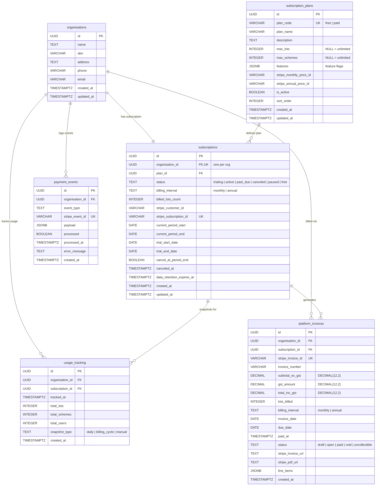

# Subscription & Billing Entity Relationship Diagram

Subscription and billing entities covering plan definitions, organisation subscriptions, usage tracking, platform invoices, and Stripe webhook event logging.

**Tables:** subscription_plans, subscriptions, usage_tracking, platform_invoices, payment_events

