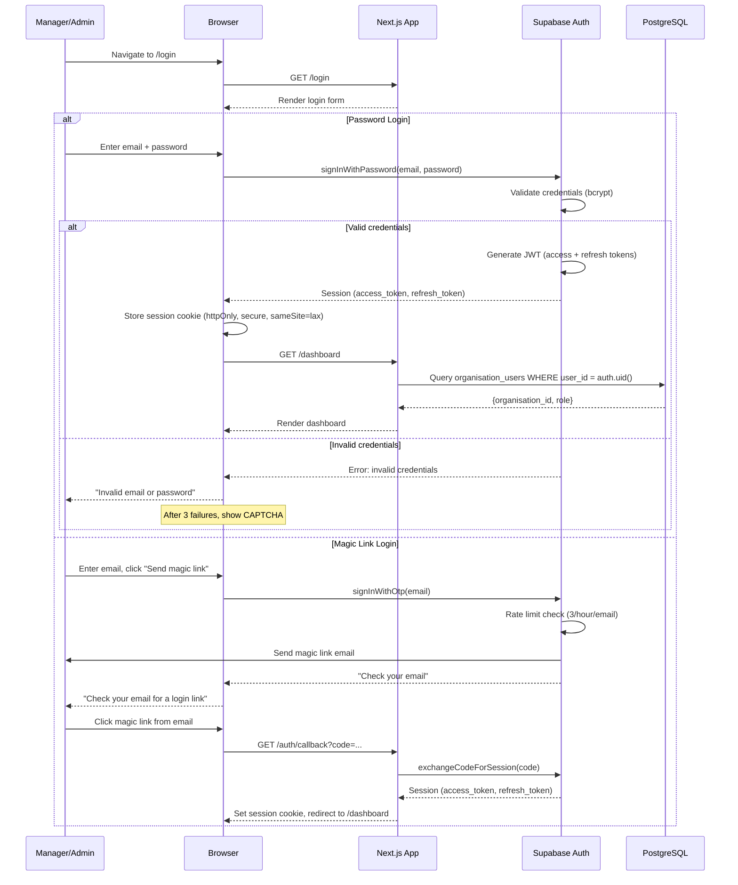
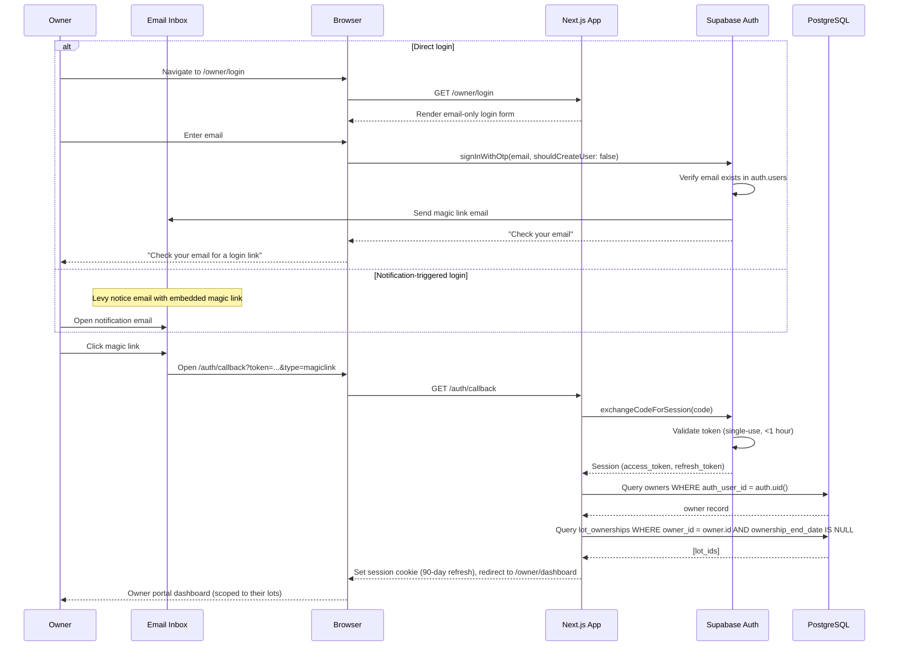
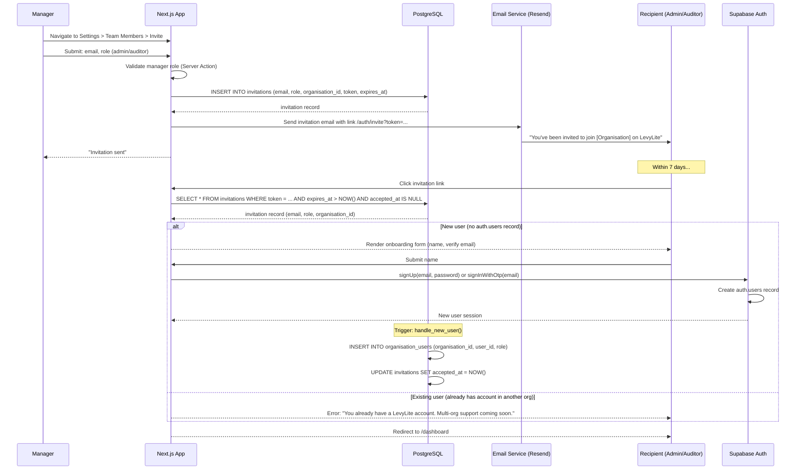
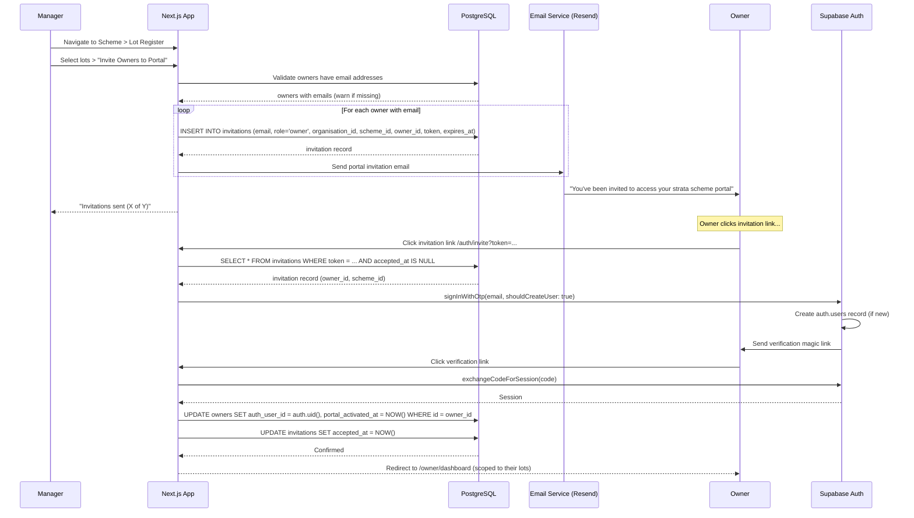
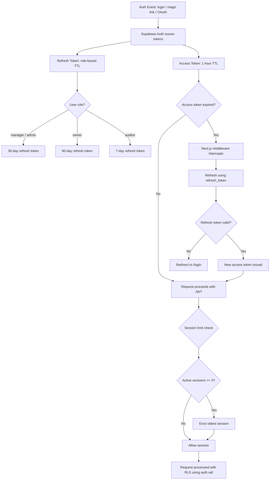
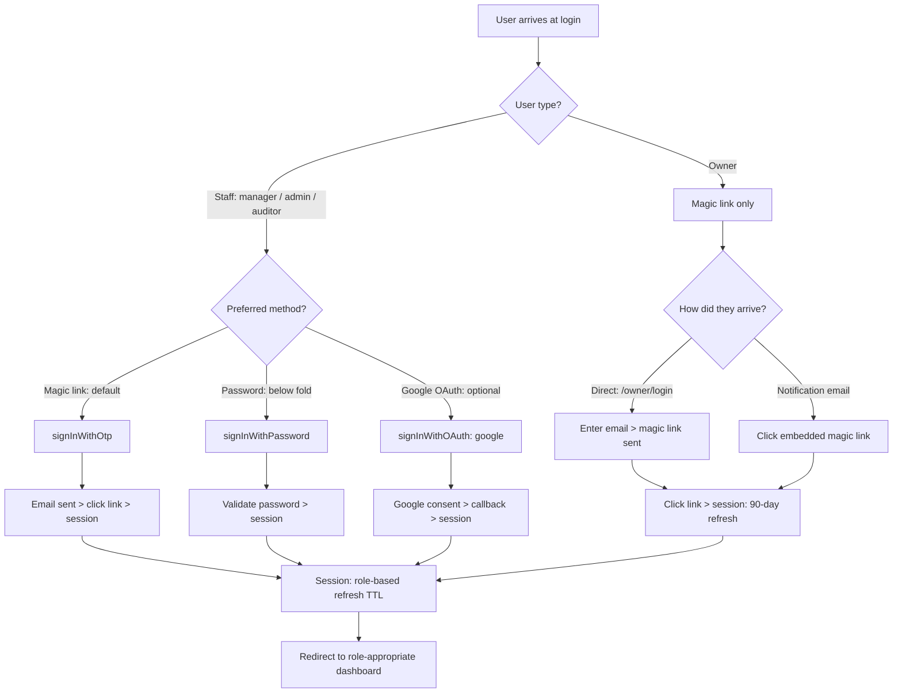

# Authentication Flows

Authentication flows for LevyLite, covering staff login (manager, admin, auditor), owner portal magic link login, user invitation/onboarding, and owner portal activation.

LevyLite uses Supabase Auth with three auth methods: magic link (primary), Google OAuth (optional for staff), and email/password (fallback for managers). Owners use magic link only.

---

## 1. Manager/Admin Login Flow (Email + Password)

Staff members (manager, admin) can log in via email/password or magic link. Password auth is available but hidden below the fold; magic link is the primary method.

---

## 2. Owner Portal Magic Link Login Flow

Owners use magic link only -- no password option, no Google OAuth. This reduces friction for users who log in infrequently (quarterly levy checks, annual AGM documents).

---

## 3. User Invitation and Onboarding Flow (Staff)

Managers invite admin and auditor users via the Settings > Team Members page. Invitations use a 7-day expiry token sent via email.

---

## 4. Owner Portal Invitation and Activation Flow

Managers invite owners from the Scheme > Lot Register. Owner invitations link directly to lot records and use magic link only.

---

## 5. Auth Callback and Session Lifecycle

Overview of token handling, session refresh, and expiry across all user types.

---

## 6. Auth Method Decision Tree

Which authentication method is used based on user type and context.

