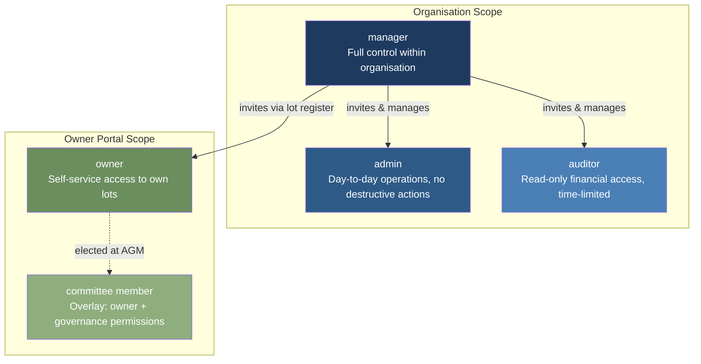
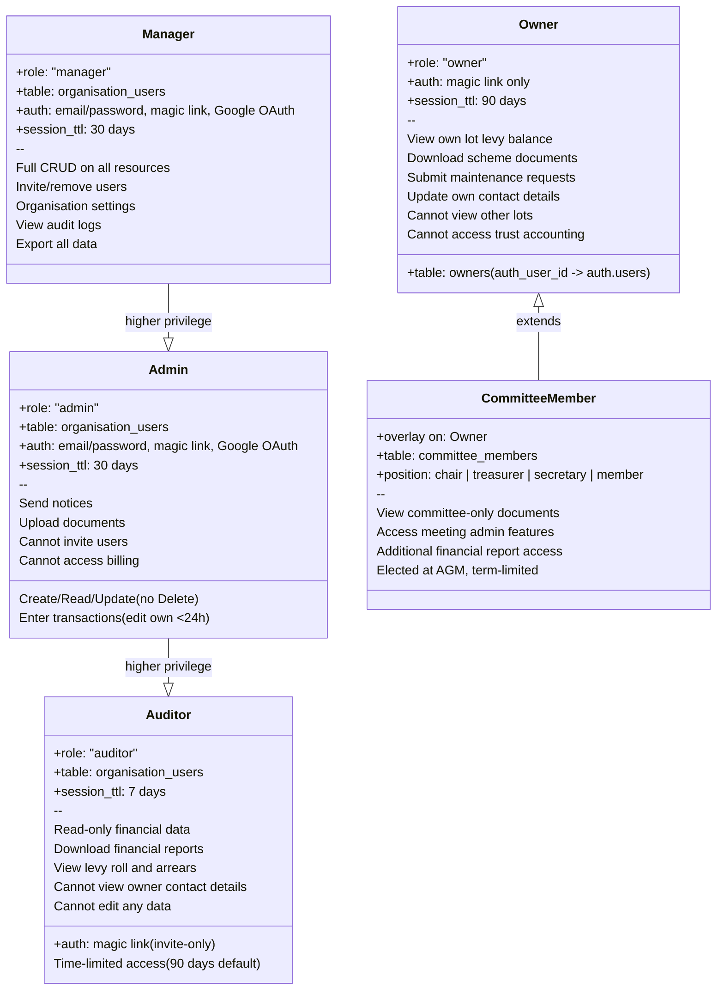
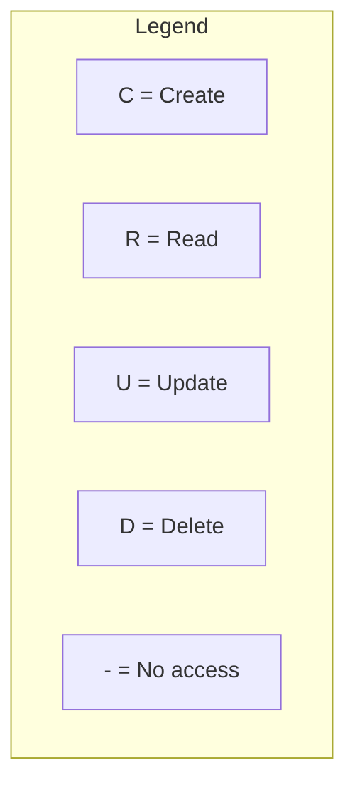
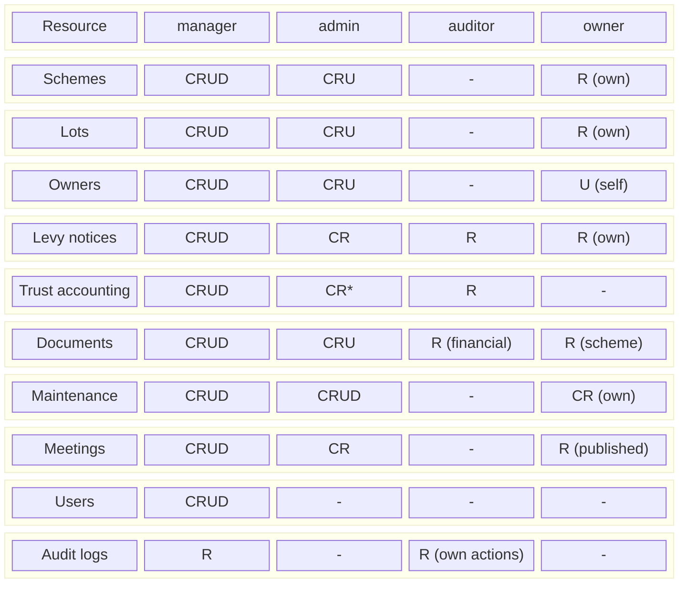
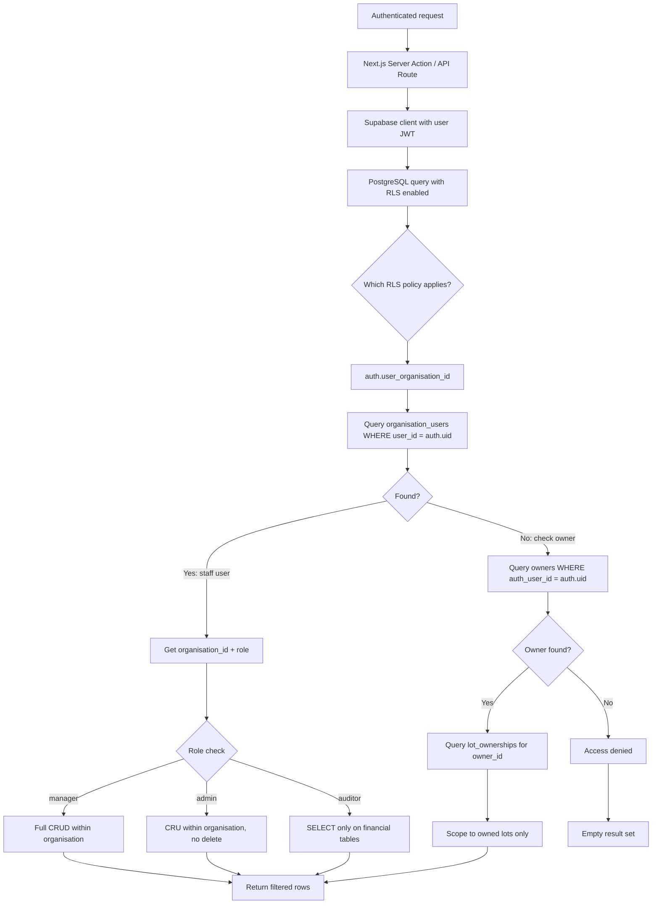
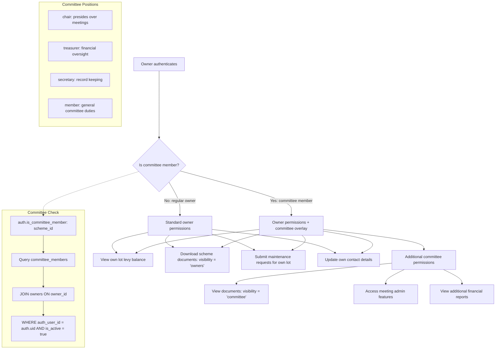
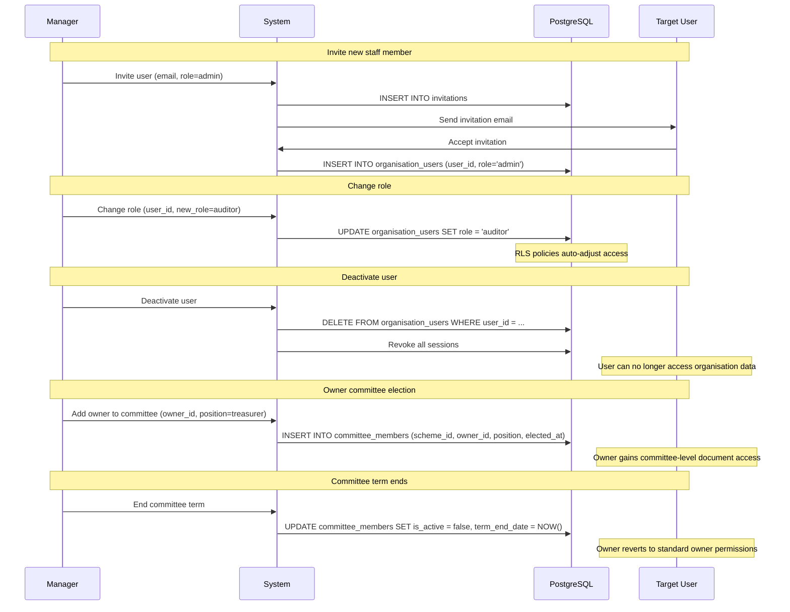

# Authorization and Roles

Role-based access control (RBAC) diagrams for LevyLite, covering the role hierarchy, permission matrix, and committee member overlay.

Roles are assigned per organisation (tenant), not globally. Staff roles (manager, admin, auditor) are stored in `organisation_users`. Owner identity is stored in the `owners` table with an optional `auth_user_id` link to Supabase Auth.

---

## 1. Role Hierarchy

The four user roles form a clear hierarchy of descending permissions. Committee member is an overlay on the owner role, not a separate role.

---

## 2. Role Details and Database Mapping

How each role maps to database tables and auth patterns.

---

## 3. Permission Matrix

Detailed CRUD permissions by role across all major resources.

*Admin can create/read transactions, edit own entries within 24 hours, cannot delete.

---

## 4. Permission Enforcement Flow

How role-based permissions are enforced at the database level via RLS policies.

---

## 5. Committee Member Overlay

Committee membership is an overlay on the owner role, granting additional permissions for governance features. It is not a separate role -- it augments owner access.

---

## 6. Role Assignment and Lifecycle

How roles are assigned, changed, and revoked throughout the user lifecycle.

