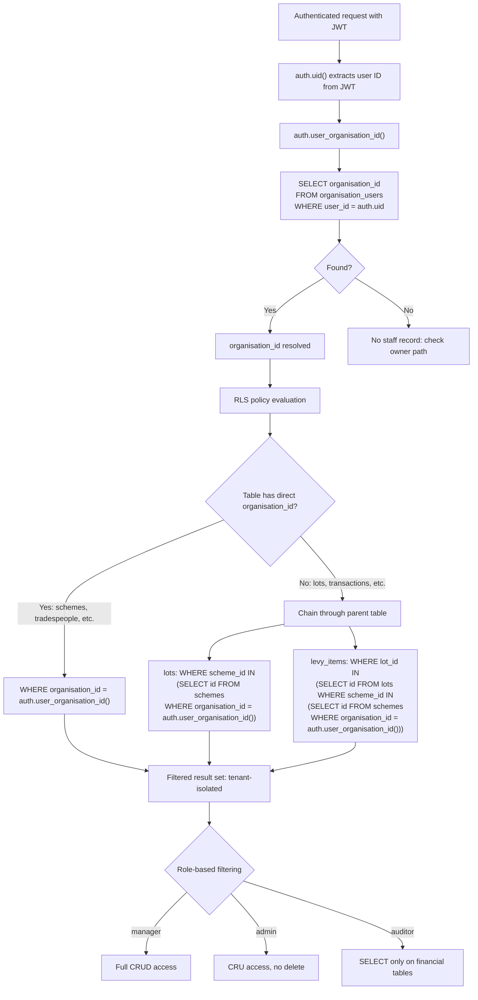
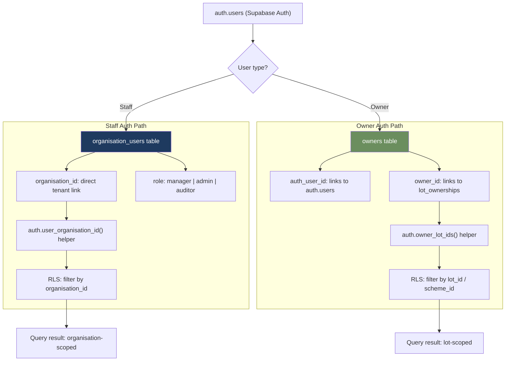
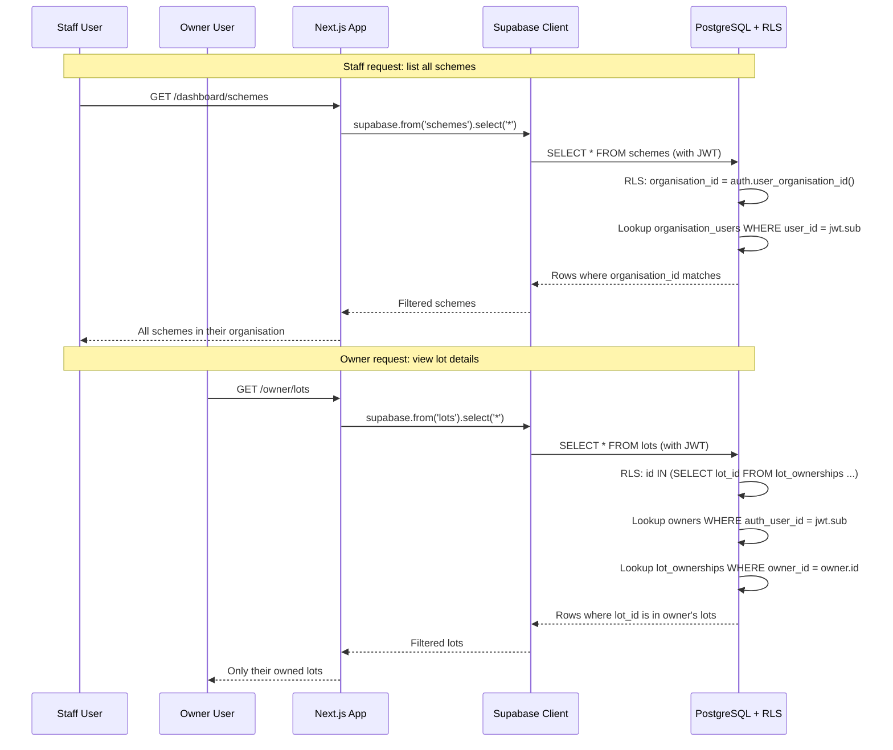
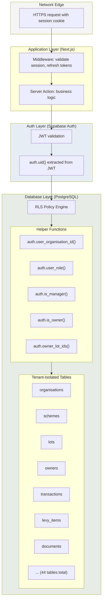
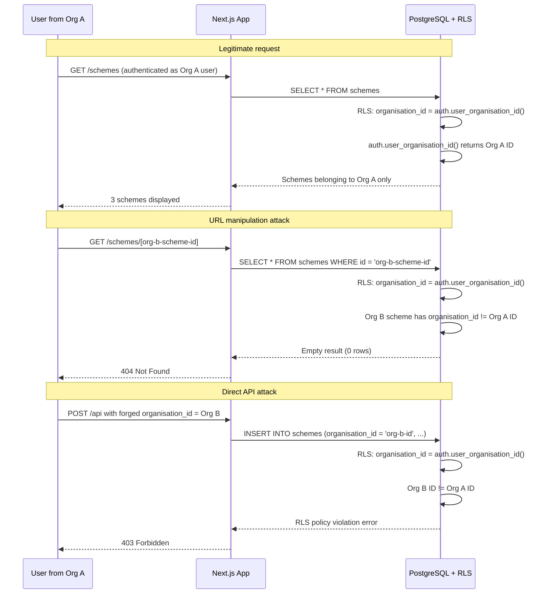
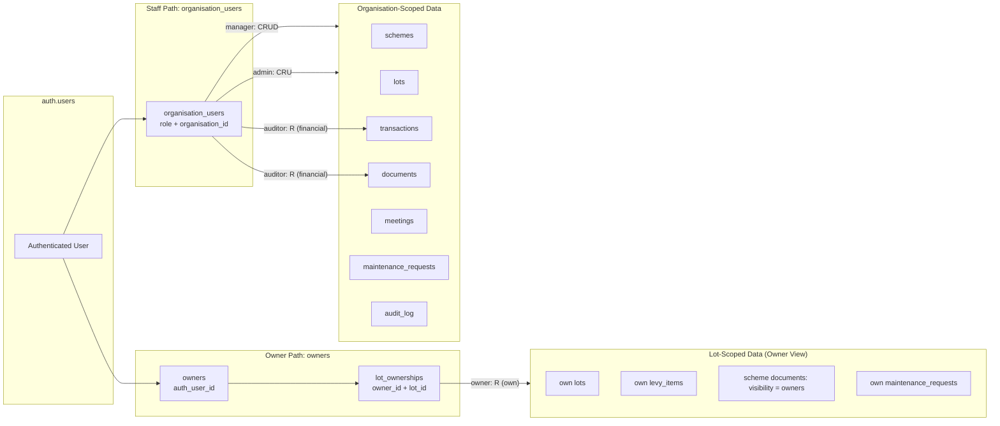

# Multi-Tenancy Isolation

Diagrams showing how LevyLite enforces strict data isolation between organisations using Supabase Row-Level Security (RLS), the dual auth model for staff vs owners, and the complete data access paths.

Each organisation (strata management business) is a tenant. All data is scoped to an organisation via `organisation_id` columns and RLS policies evaluated on every database query.

---

## 1. RLS Policy Flow: Staff Access Path

Staff users (manager, admin, auditor) are authenticated via `organisation_users`. RLS policies resolve the user's organisation and filter all data accordingly.



---

## 2. Owner Portal Access Path

Owner portal users are authenticated via the `owners` table (`owners.auth_user_id`), not `organisation_users`. Data access is scoped to the lots they own.

```mermaid
flowchart TD
    A[Owner authenticates via magic link] --> B["auth.uid() from JWT"]

    B --> C["auth.is_owner()"]
    C --> D[SELECT EXISTS<br/>FROM owners<br/>WHERE auth_user_id = auth.uid]
    D --> E{Is owner?}

    E -->|Yes| F[Resolve owned lots]
    E -->|No| G[Access denied: not an owner]

    F --> H["auth.owner_lot_ids()"]
    H --> I[SELECT lot_id FROM lot_ownerships<br/>WHERE owner_id IN<br/>(SELECT id FROM owners WHERE auth_user_id = auth.uid)<br/>AND ownership_end_date IS NULL]

    I --> J[Set of owned lot IDs]

    J --> K[RLS policy: lot-scoped access]
    K --> K1["lots: WHERE id IN (owner_lot_ids)"]
    K --> K2["levy_items: WHERE lot_id IN (owner_lot_ids)"]
    K --> K3["maintenance_requests: WHERE submitted_by = owner.id"]

    J --> L[RLS policy: scheme-scoped documents]
    L --> L1[Resolve scheme_ids from owned lots]
    L1 --> L2["documents: WHERE scheme_id IN (owner_scheme_ids)<br/>AND visibility IN ('owners', 'committee')"]

    K1 --> M[Owner sees only their data]
    K2 --> M
    K3 --> M
    L2 --> M
```

---

## 3. Dual Auth Model

LevyLite uses two parallel auth patterns: staff via `organisation_users` and owners via `owners.auth_user_id`. Both resolve to `auth.users` but follow different data access paths.



---

## 4. Dual Auth Model -- Sequence Detail

Step-by-step comparison of how a staff request and an owner request are processed through the same Supabase RLS infrastructure.



---

## 5. Tenant Isolation Architecture

Complete view of how organisation boundaries are enforced from the network edge to the database.



---

## 6. Cross-Tenant Isolation: What Gets Blocked

Demonstrates how RLS prevents data leakage between organisations, even if the application layer is compromised.



---

## 7. Data Access Scope by Role

Summary of what data each role can access and through which path.


