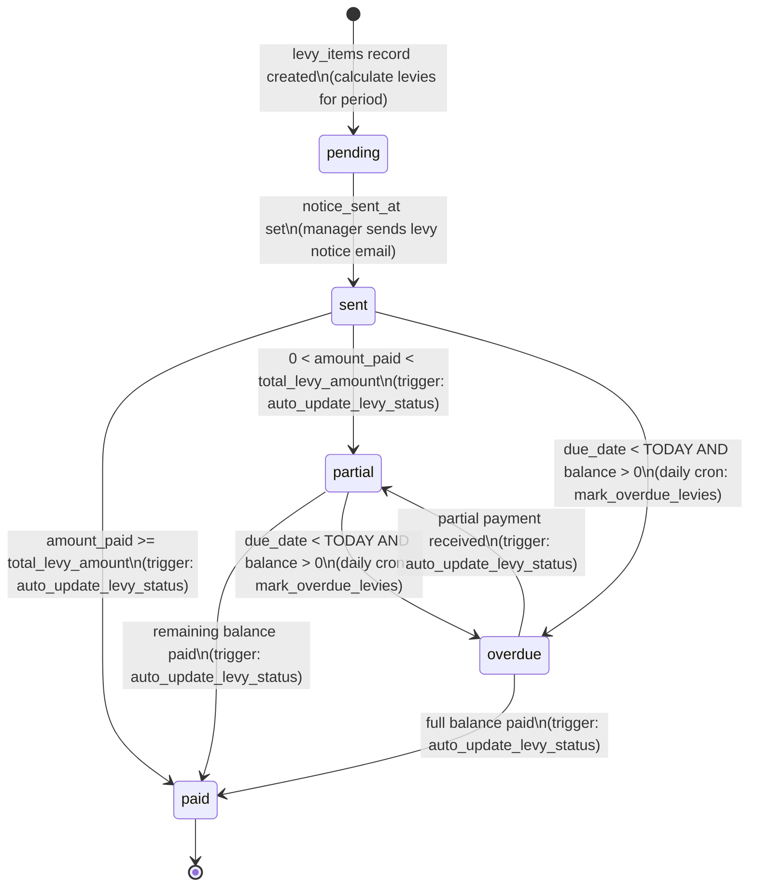
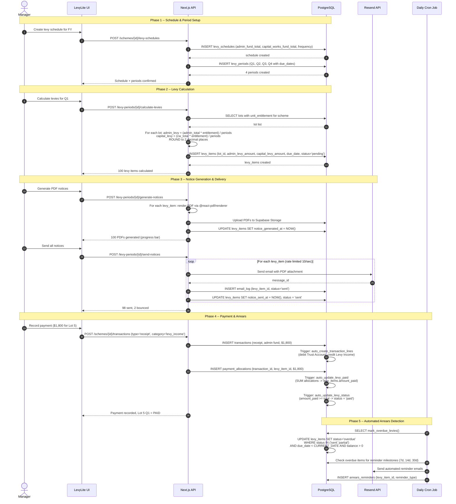
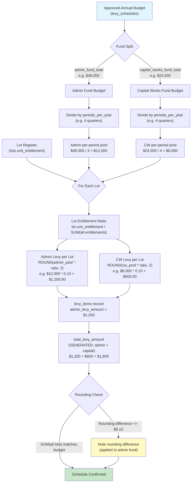
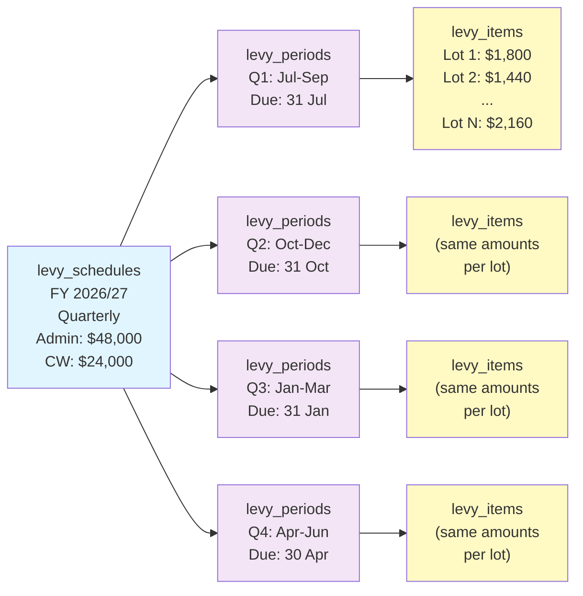

# Levy Lifecycle Diagrams

These diagrams describe the full levy lifecycle: from schedule creation through period generation, notice sending, payment recording, and status management.

---

## 1. Levy Item Status Diagram

A levy item (`levy_items`) tracks a single lot's obligation for a single billing period. Its status transitions are driven by manager actions and automated triggers.



**Key triggers:**
- `auto_update_levy_status` -- BEFORE INSERT OR UPDATE on `levy_items`, evaluates `amount_paid` vs `total_levy_amount` and `due_date` vs `CURRENT_DATE`.
- `mark_overdue_levies()` -- daily cron job (03:00 AWST) updates `sent` or `partial` items past due date to `overdue`.

---

## 2. Full Levy Workflow (Sequence Diagram)

End-to-end workflow from budget approval through to payment recording. Shows the manager's actions and system automation.



---

## 3. Levy Calculation Flow

Shows how the approved scheme budget flows through unit entitlements to produce per-lot levy amounts.



**Calculation formula:**
```
Admin Levy (per lot, per period) = ROUND(admin_fund_total * unit_entitlement / periods_per_year, 2)
CW Levy (per lot, per period)    = ROUND(capital_works_fund_total * unit_entitlement / periods_per_year, 2)
Total Levy                       = admin_levy_amount + capital_levy_amount  (GENERATED column)
```

---

## 4. Levy Period Generation

Shows how a single levy schedule produces multiple billing periods with their corresponding levy items.



**Relationships:**
- `levy_schedules` 1 --- N `levy_periods` (one schedule has N periods, where N = periods_per_year)
- `levy_periods` 1 --- M `levy_items` (one period has M items, where M = number of lots in the scheme)
- Each `levy_item` has a unique constraint on `(lot_id, levy_period_id)`
