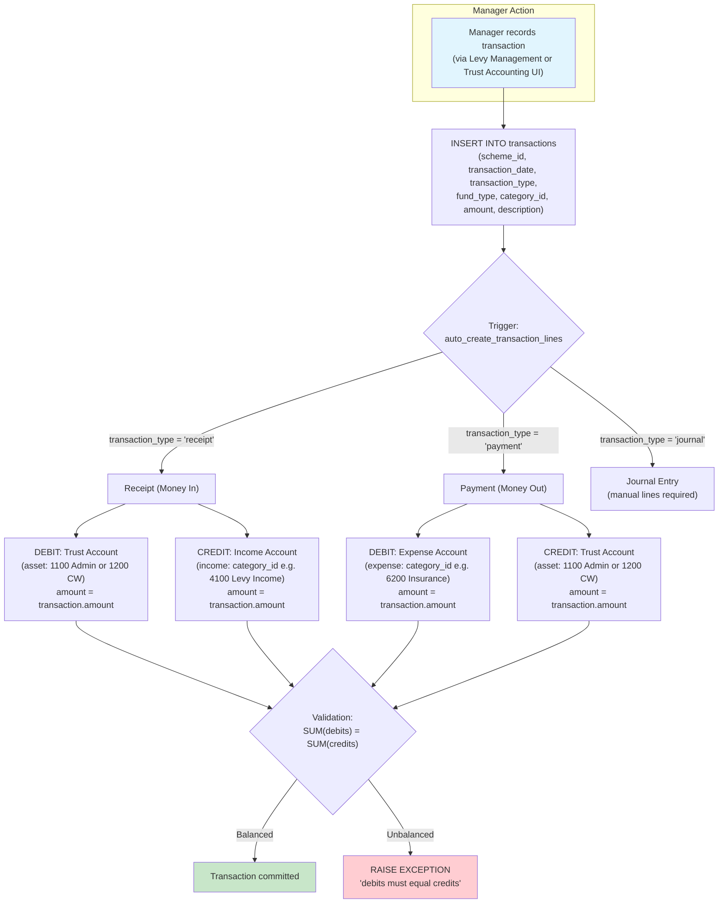
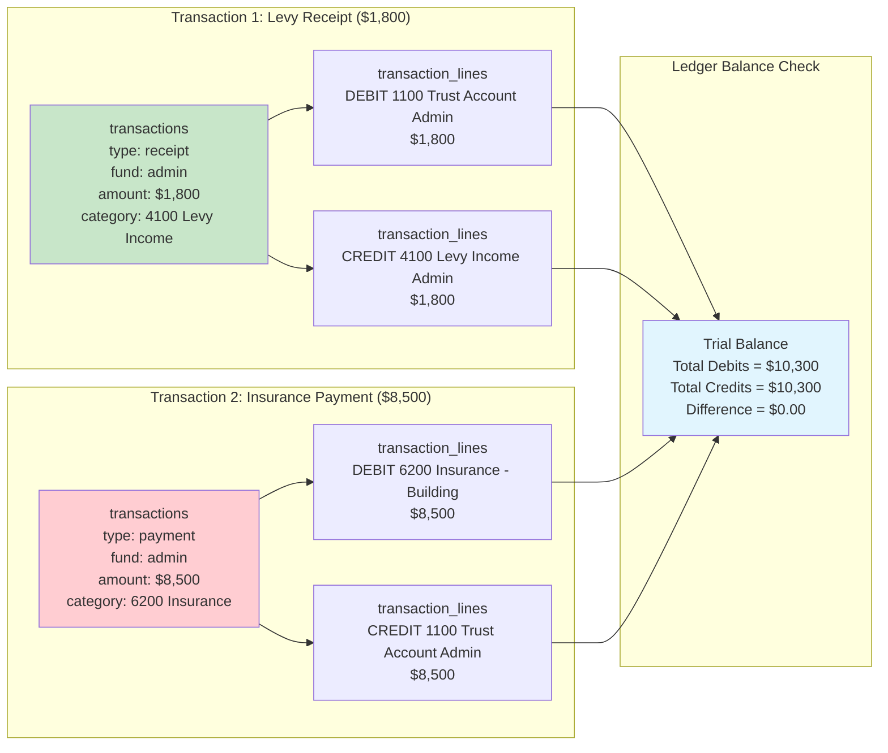
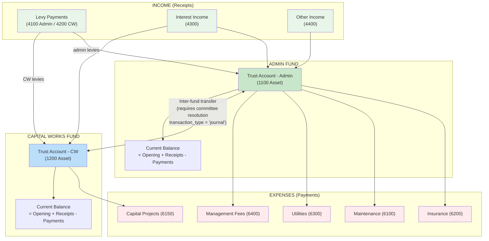
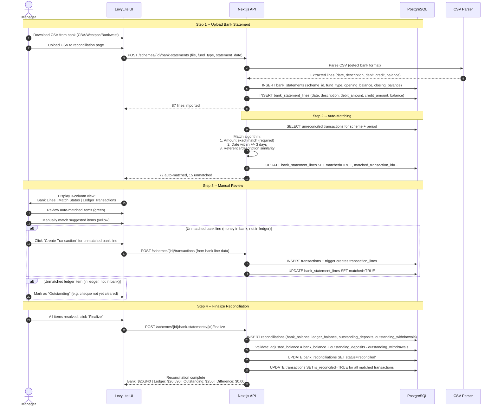
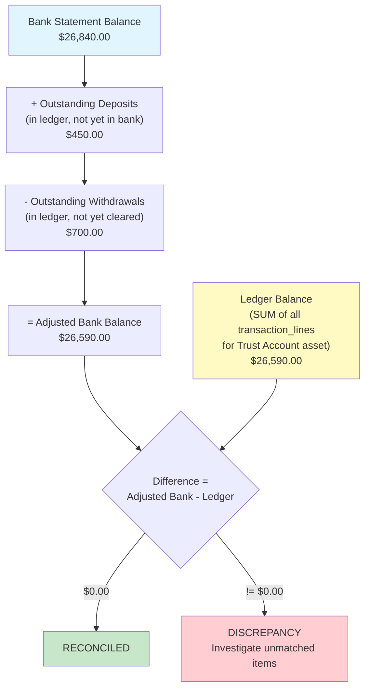

# Trust Accounting Diagrams

These diagrams describe the double-entry accounting system, fund management, and bank reconciliation workflow that form the financial backbone of LevyLite.

---

## 1. Double-Entry Accounting: Transaction to Transaction Lines

Every record in `transactions` automatically generates balanced debit/credit pairs in `transaction_lines` via the `auto_create_transaction_lines` trigger.

**Key accounts used by trigger:**
| Fund Type | Trust Account (Asset) | Code |
|-----------|----------------------|------|
| admin | Trust Account - Admin Fund | 1100 |
| capital_works | Trust Account - Capital Works Fund | 1200 |

**Trigger logic (simplified):**
- Receipt: Debit bank (asset increases), Credit income category
- Payment: Debit expense category, Credit bank (asset decreases)
- Journal: Application must supply lines manually (inter-fund transfers)

---

## 2. Double-Entry Ledger Example

Concrete example showing how a levy receipt and an insurance payment each produce balanced ledger entries.

---

## 3. Fund Flow: Admin Fund vs Capital Works Fund

Each strata scheme maintains two separate funds. Receipts flow in (levies, interest, other income) and payments flow out (expenses). Inter-fund transfers require committee resolution.

**Fund separation rules (WA Strata Titles Act):**
- Admin fund covers day-to-day operating expenses
- Capital works fund covers long-term capital projects
- Funds must be separately accounted (separate `fund_type` on every transaction)
- Inter-fund transfers require committee resolution reference
- Capital works funds cannot be used for admin expenses without owner approval

---

## 4. Bank Reconciliation Workflow

Monthly process to match the trust account ledger against the actual bank statement, ensuring accuracy and compliance.

---

## 5. Bank Reconciliation Balance Diagram

Visual breakdown of how reconciliation proves ledger accuracy.

**Reconciliation tables:**
- `bank_statements` -- uploaded statement metadata (scheme, fund, date, opening/closing balance)
- `bank_statement_lines` -- individual lines parsed from CSV (linked to `matched_transaction_id` when matched)
- `reconciliations` -- final reconciliation record with balances and status
