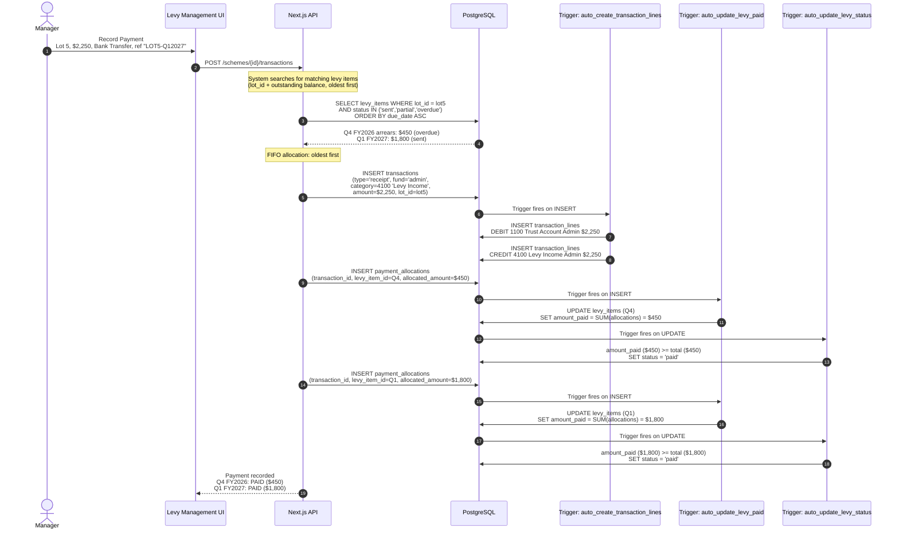
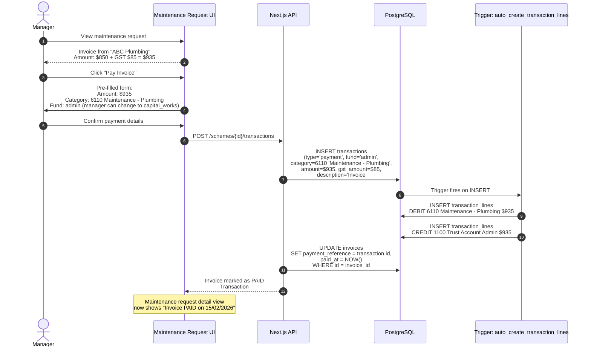
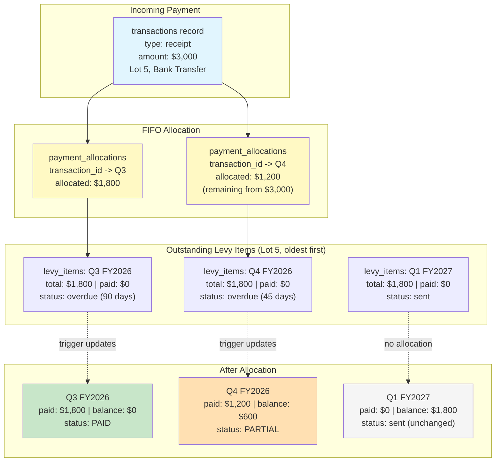
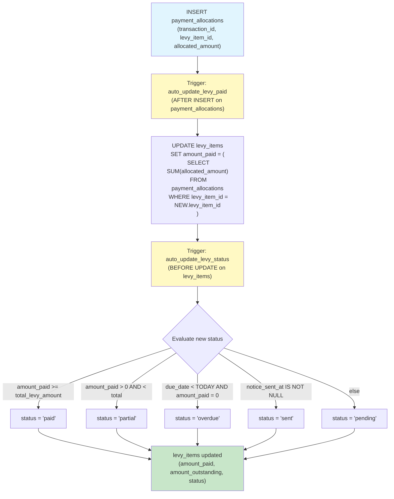
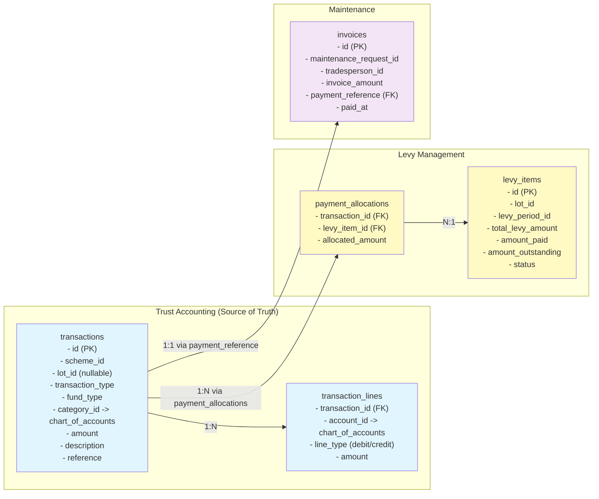

# Payment Flow Diagrams

These diagrams describe how levy payments and maintenance invoice payments integrate with the trust accounting system. The `transactions` table is the **single source of truth** for all financial data -- there is no separate `payments` table.

---

## 1. Levy Payment Flow

When a manager records a levy payment, the system creates a `transactions` record (receipt), links it to the relevant `levy_items` via `payment_allocations`, and triggers update the levy item's paid amount and status.

---

## 2. Maintenance Invoice Payment Flow

When a manager pays a maintenance invoice, the system creates a `transactions` record (payment) and links it back to the invoice via `invoices.payment_reference`.

---

## 3. Payment Allocation: One Payment Covering Multiple Levy Items

Demonstrates FIFO (oldest-first) allocation when a single payment covers multiple outstanding levy items, including partial payment scenarios.

**Allocation logic:**
1. Query `levy_items` for the lot, ordered by `due_date ASC` (oldest first)
2. Allocate payment amount to each item until payment is exhausted:
   - If remaining payment >= item balance: fully pay the item, move to next
   - If remaining payment < item balance: partially pay the item, stop
3. Create `payment_allocations` record for each allocation
4. Triggers cascade: `auto_update_levy_paid` -> `auto_update_levy_status`

---

## 4. Trigger Chain: Payment to Status Update

Shows the full cascade of database triggers that fire when a payment allocation is inserted.

**Important notes:**
- `amount_outstanding` is a GENERATED column: `total_levy_amount - amount_paid`
- The `auto_update_levy_paid` trigger recalculates from the SUM of all allocations (not incremental), making it safe for updates and deletes
- The `auto_update_levy_status` trigger runs BEFORE UPDATE, modifying the NEW row before it is written

---

## 5. Data Model: Payment Flow Entity Relationships

Shows how the `transactions` table connects to both levy items (via `payment_allocations`) and maintenance invoices (via `invoices.payment_reference`), serving as the single source of truth.

**Key design decisions:**
- There is NO separate `payments` table. The `transactions` table records all financial activity.
- Levy payments: `transactions` (receipt) linked to `levy_items` via `payment_allocations` (many-to-many, one payment can cover multiple levies)
- Maintenance payments: `transactions` (payment) linked to `invoices` via `invoices.payment_reference` (one-to-one)
- Both types of transactions generate `transaction_lines` (debit/credit pairs) via the `auto_create_transaction_lines` trigger
