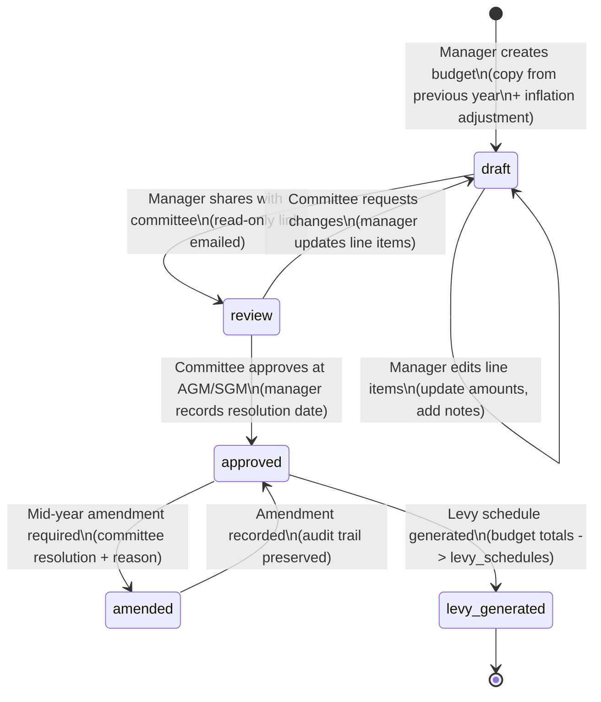
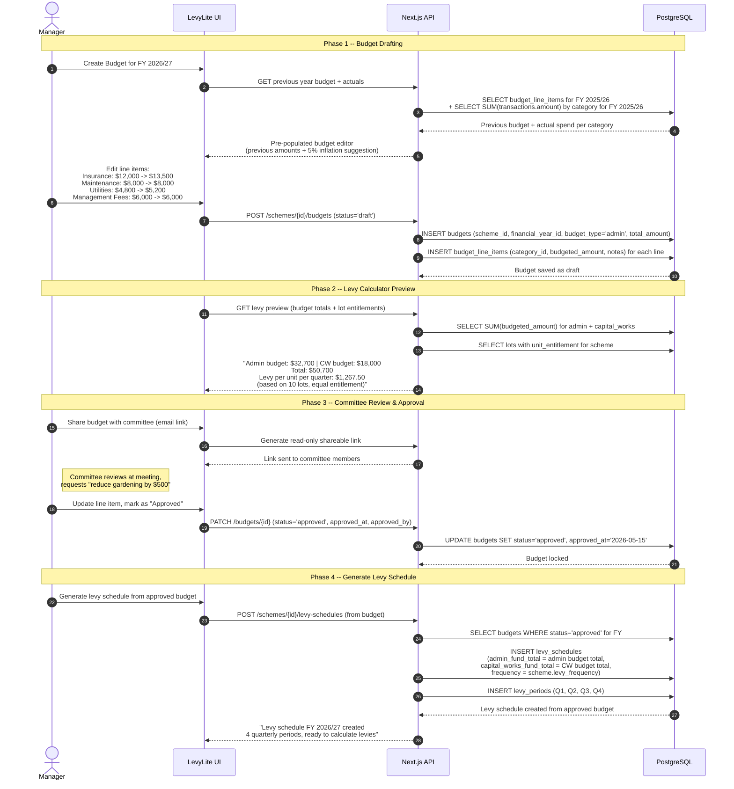
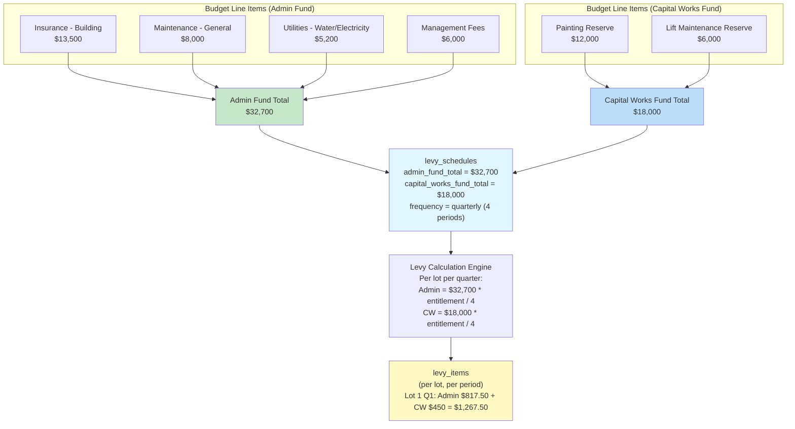
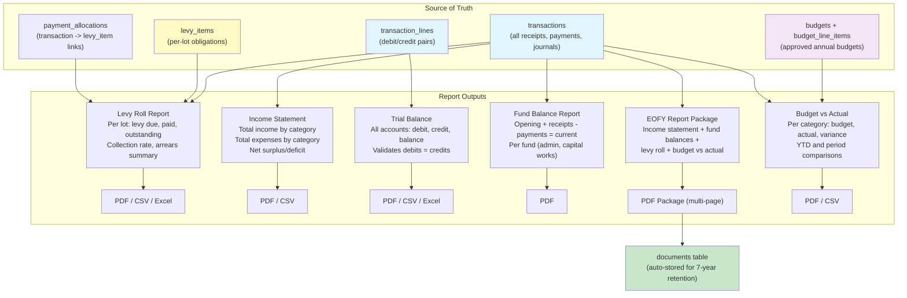
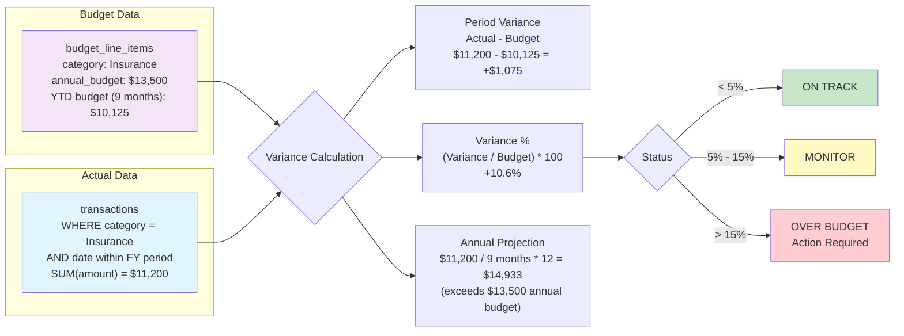
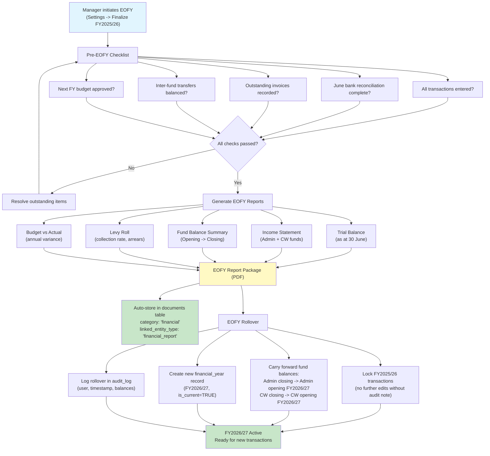

# Budget & Reporting Diagrams

These diagrams describe the budget lifecycle (creation through AGM approval to levy schedule generation), financial reporting flows, and budget vs actual comparison.

---

## 1. Budget Workflow

Full lifecycle of a scheme budget: from initial draft through committee review, AGM approval, and generation of the corresponding levy schedule.

---

## 2. Budget Creation and Levy Schedule Generation (Sequence Diagram)

Shows the end-to-end flow from budget drafting to the generation of levy schedules and per-lot levy amounts.

---

## 3. Budget Line Items to Levy Amounts

Shows how approved budget line items aggregate into fund totals, which then flow into the levy calculation engine.

---

## 4. Financial Reporting Flow

Shows how data from `transactions` flows into each report type. All reports are generated on-demand from the same transaction data.

**Report descriptions:**

| Report | Purpose | Key Data Sources | Frequency |
|--------|---------|-----------------|-----------|
| Levy Roll | Per-lot levy status for AGM | levy_items, payment_allocations, transactions | Quarterly / on-demand |
| Income Statement | Revenue and expenses by category | transactions (receipts + payments) | Monthly / quarterly |
| Trial Balance | Accounting verification (debits = credits) | transaction_lines | On-demand / EOFY |
| Fund Balance | Current fund health snapshot | transactions (running totals) | Monthly / on-demand |
| EOFY Report | Annual financial package for AGM | All sources combined | Annual |
| Budget vs Actual | Spending against approved budget | budgets, budget_line_items, transactions | Monthly / quarterly |

---

## 5. Budget vs Actual Comparison

Shows how budget data and actual transaction data combine to produce variance analysis.

---

## 6. EOFY Report Generation Workflow

End-of-financial-year process that produces the comprehensive financial package required for AGM presentation.

**EOFY rollover details:**
- Fund closing balances are calculated from `transactions`: `SUM(receipts) - SUM(payments)` for the FY period
- Opening balances for new FY are stored in `financial_years.admin_opening_balance` and `financial_years.capital_opening_balance` (if these columns exist) or derived from historical transactions
- Income/expense accounts reset to zero for the new FY (they are period-specific)
- Asset accounts (trust bank accounts) carry forward their running balance
