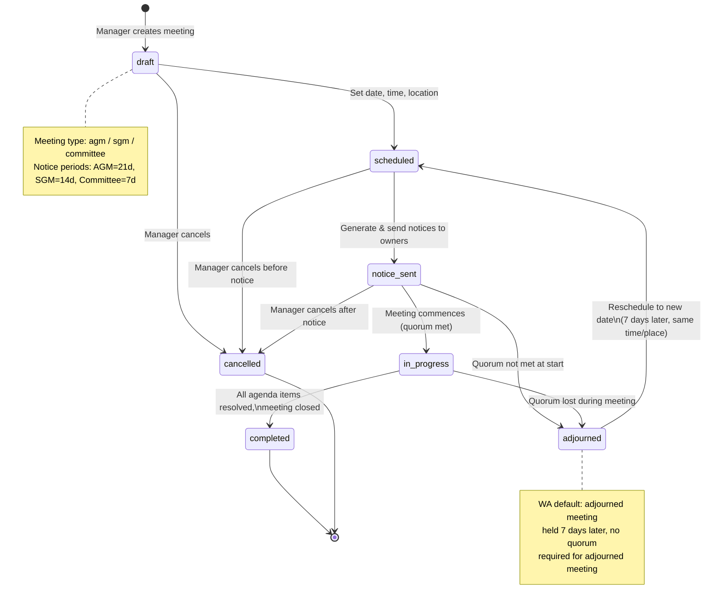
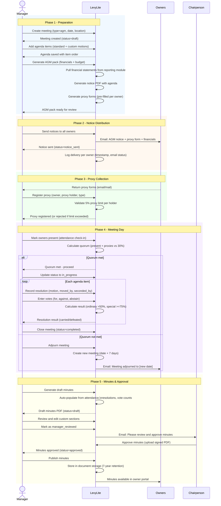
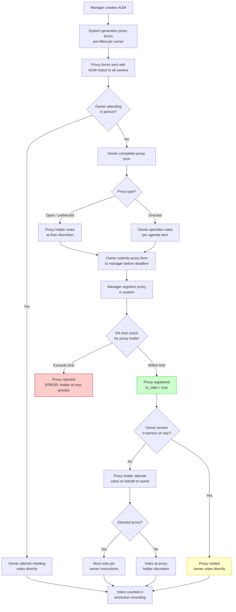
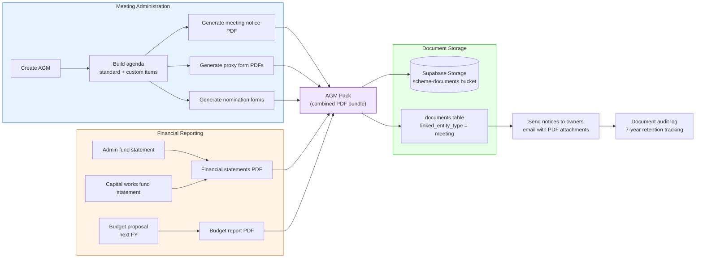
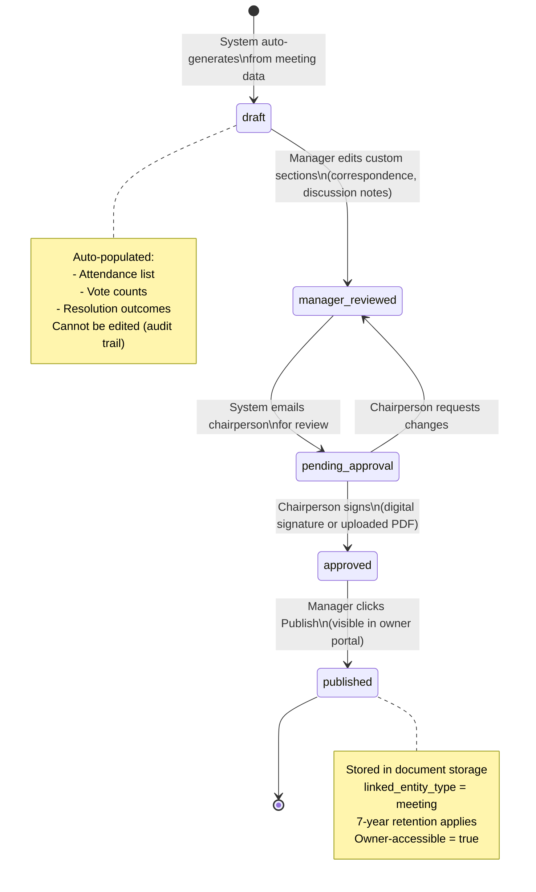

# Meeting Administration Workflows

Diagrams for the meeting administration feature (AGM, SGM, committee meetings). Covers meeting lifecycle states, AGM end-to-end workflow, proxy voting flow, and AGM pack generation (cross-feature integration).

Reference: [Feature 05 - Meeting Administration](../features/05-meeting-administration.md)

---

## 1. Meeting Status State Diagram

Shows the lifecycle of a meeting from draft through completion, adjournment, or cancellation.

---

## 2. AGM Workflow Sequence Diagram

End-to-end sequence for running an Annual General Meeting, from creation through minutes publication.

---

## 3. Proxy Voting Flow

Shows how proxy voting works from form generation through vote casting, including the WA 5% limit enforcement.

---

## 4. AGM Pack Generation (Cross-Feature Integration)

Shows how the AGM pack brings together documents from meeting administration, financial reporting, and document storage.

---

## 5. Minutes Approval Workflow

Shows the status progression of meeting minutes from auto-generation through publication.

