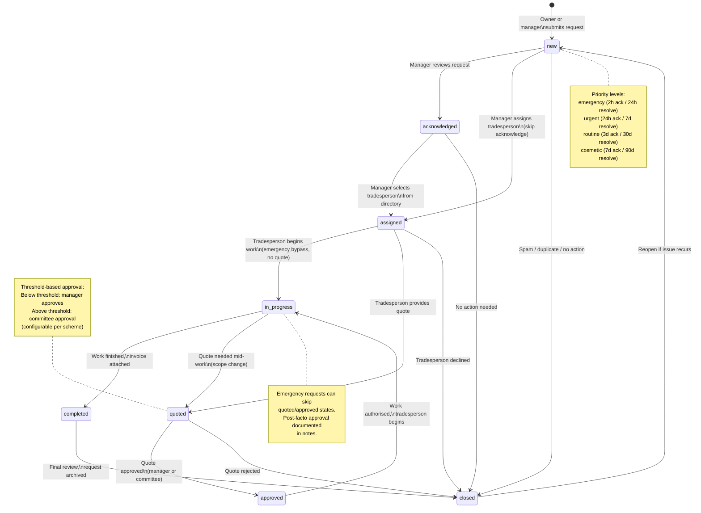
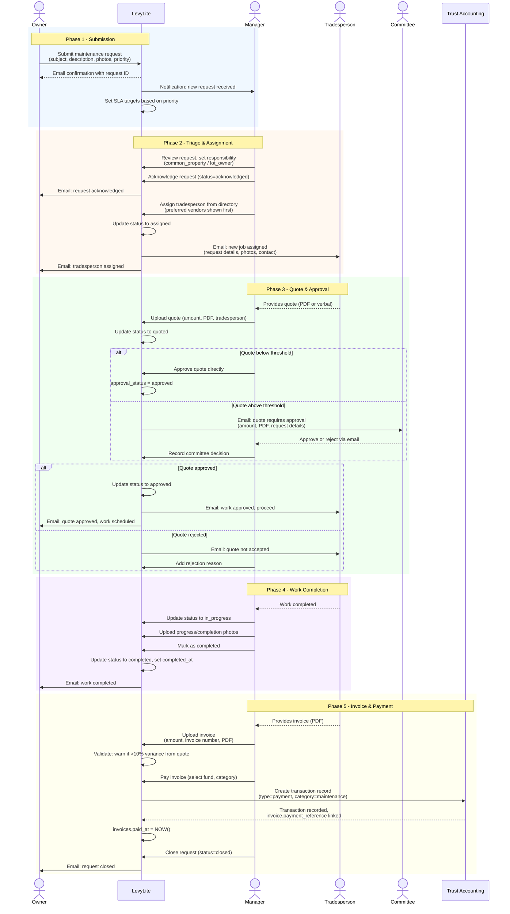
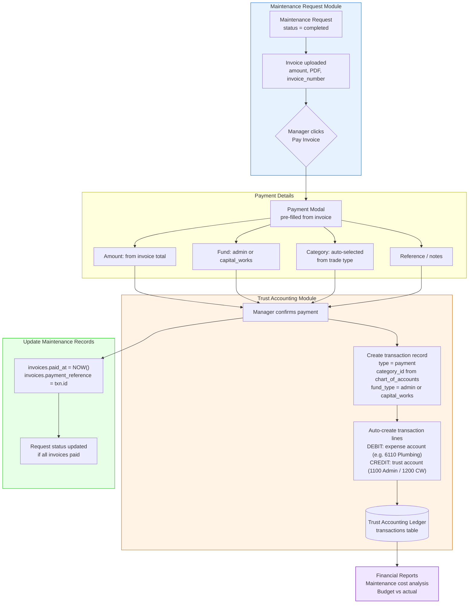
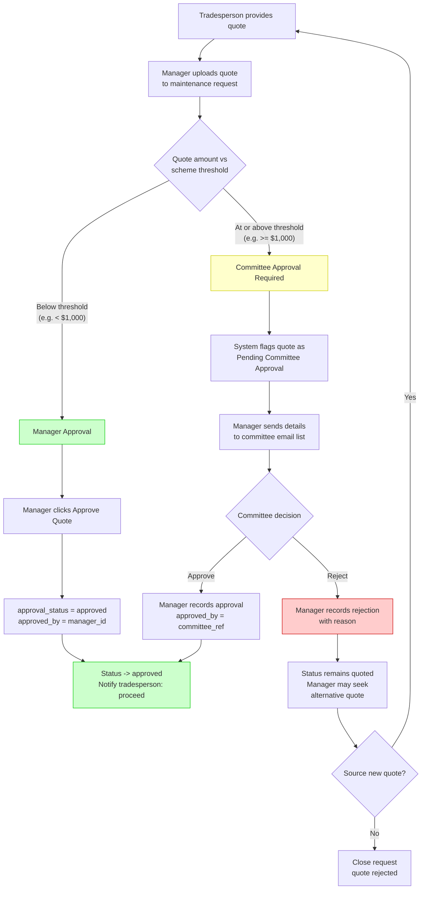
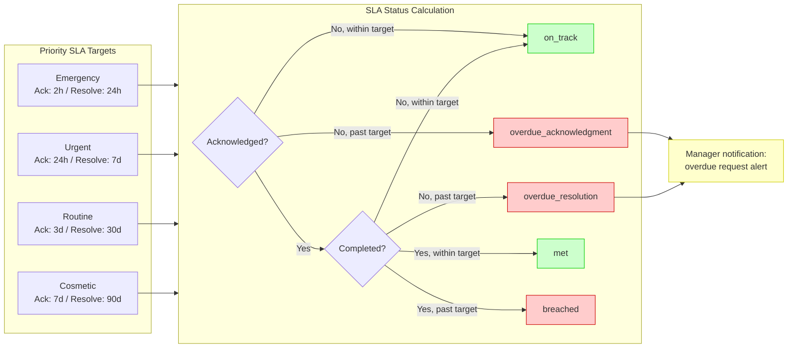

# Maintenance Request Workflows

Diagrams for the maintenance request tracking feature. Covers request lifecycle states, the full request-to-payment sequence, and integration with trust accounting.

Reference: [Feature 06 - Maintenance Requests](../features/06-maintenance-requests.md)

---

## 1. Maintenance Request Status State Diagram

Shows all valid status transitions for a maintenance request, including the emergency bypass path and quote approval routing.

---

## 2. Maintenance Request Sequence Diagram

Full lifecycle from owner submission through invoice payment, showing all participants and system interactions.

---

## 3. Maintenance to Trust Accounting Integration

Shows how maintenance invoice payments flow into the trust accounting ledger, creating the financial audit trail.

---

## 4. Quote Approval Threshold Routing

Shows how quote amounts are routed to the appropriate approver based on per-scheme thresholds.

---

## 5. SLA Tracking States

Shows how SLA status is calculated based on priority targets and elapsed time.

