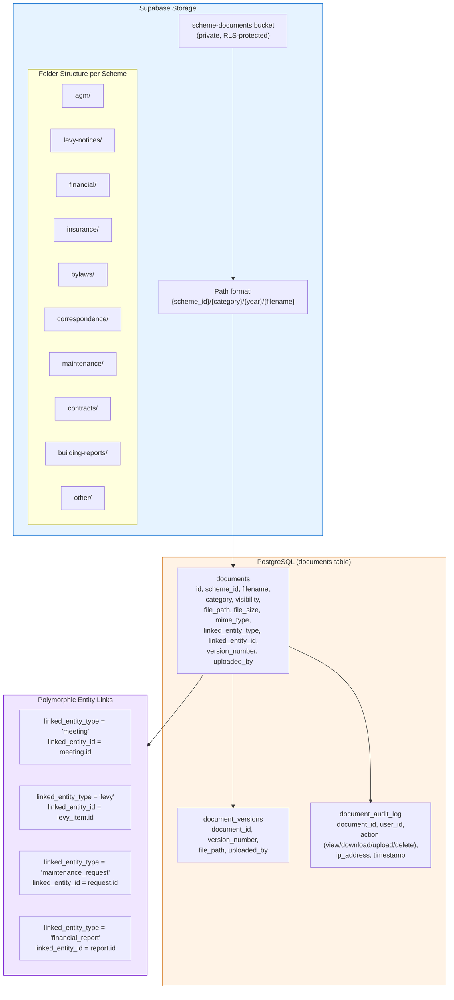
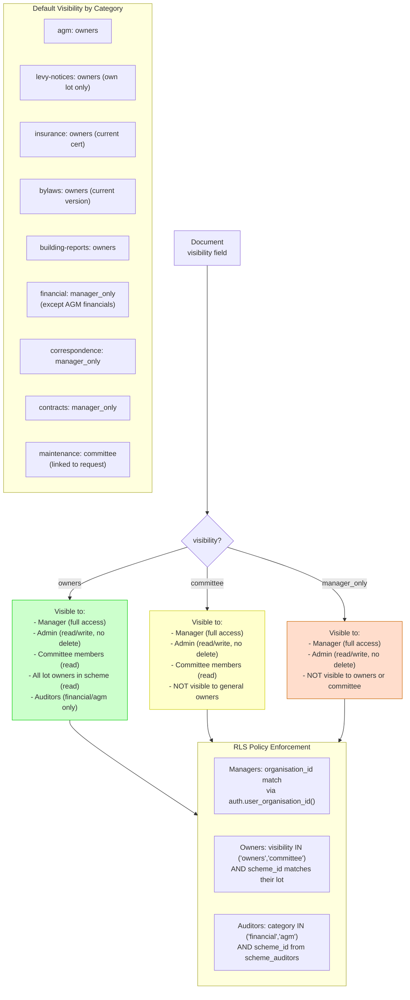
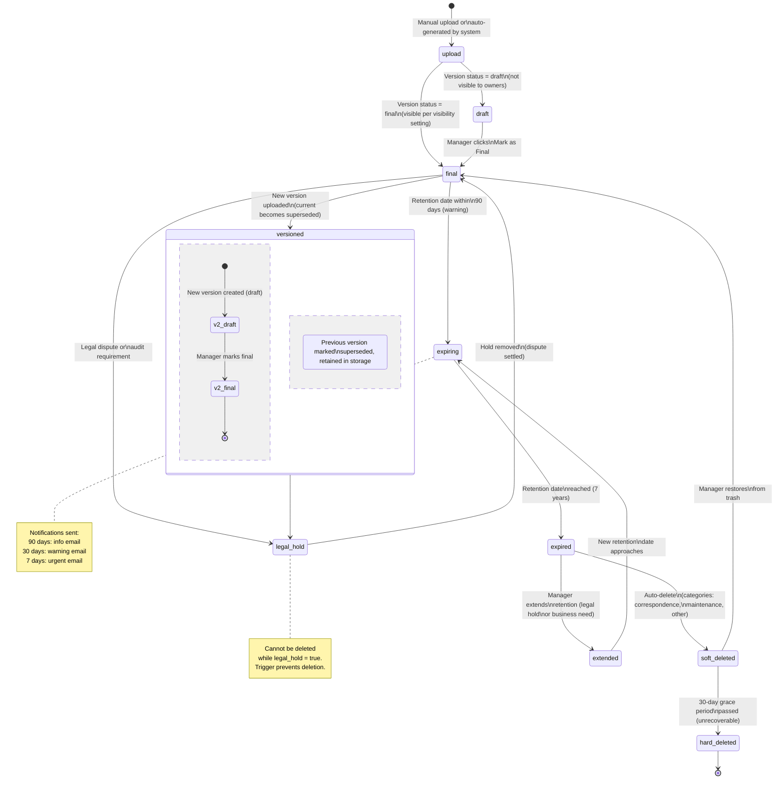
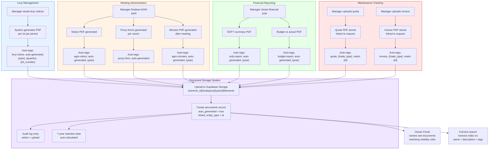
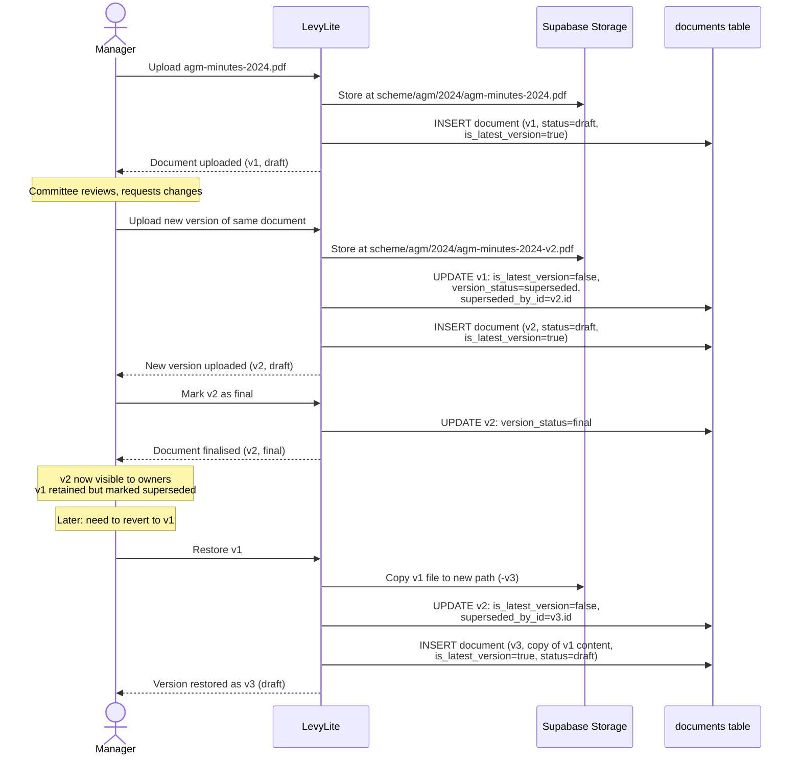
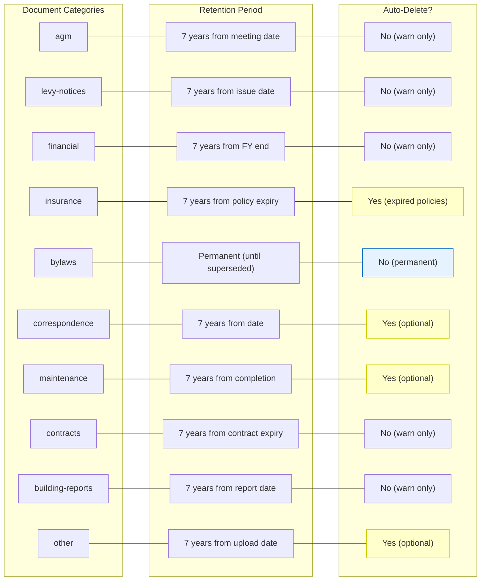

# Document Management Workflows

Diagrams for the document storage and management feature. Covers storage architecture, access control model, document lifecycle, and auto-generated document integration.

Reference: [Feature 07 - Document Storage](../features/07-document-storage.md)

---

## 1. Document Storage Architecture

Shows the relationship between Supabase Storage (file storage), the documents table (metadata), and polymorphic entity linking.

---

## 2. Document Visibility & Access Control

Shows who can access documents based on the visibility setting and user role. Three tiers: owners (broadest), committee, and manager_only (most restricted).

---

## 3. Document Lifecycle

Shows the full lifecycle of a document from upload through 7-year retention and eventual deletion.

---

## 4. Auto-Generated Documents Integration

Shows how other LevyLite features automatically generate documents and store them in the document management system.

---

## 5. Document Version Control Flow

Shows how document versioning works with the simple replacement model.

---

## 6. Retention Policy by Category

Shows the retention rules for each document category and whether auto-deletion applies.

