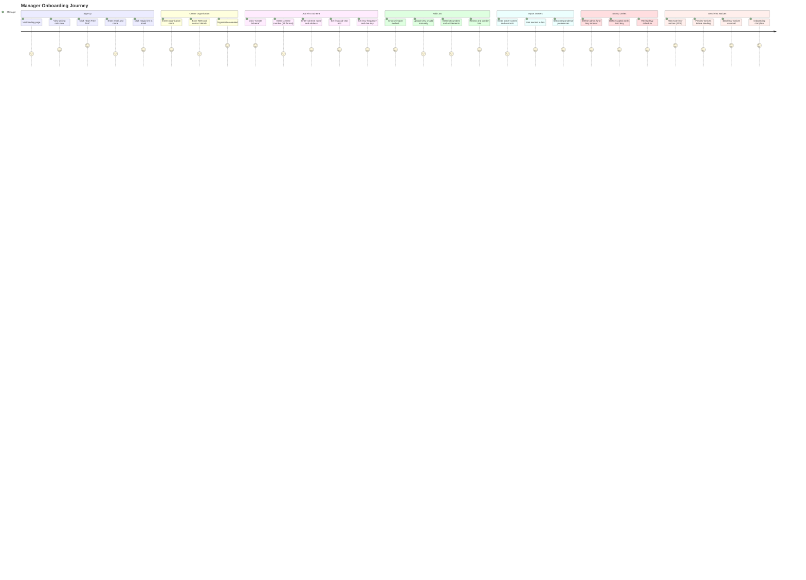
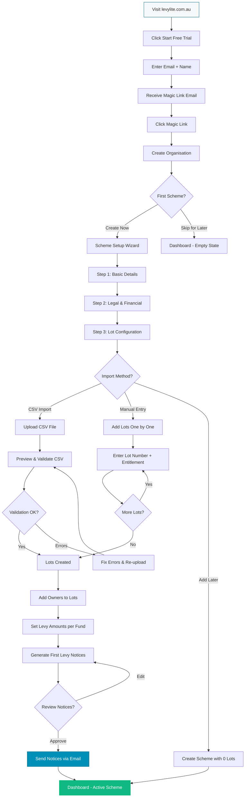
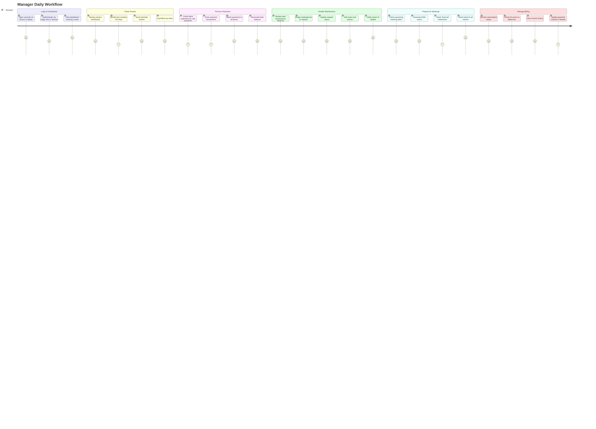
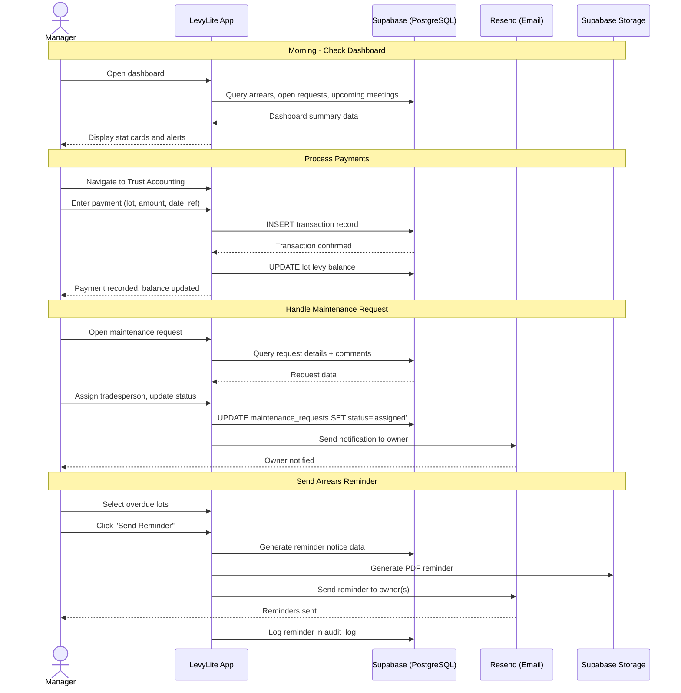
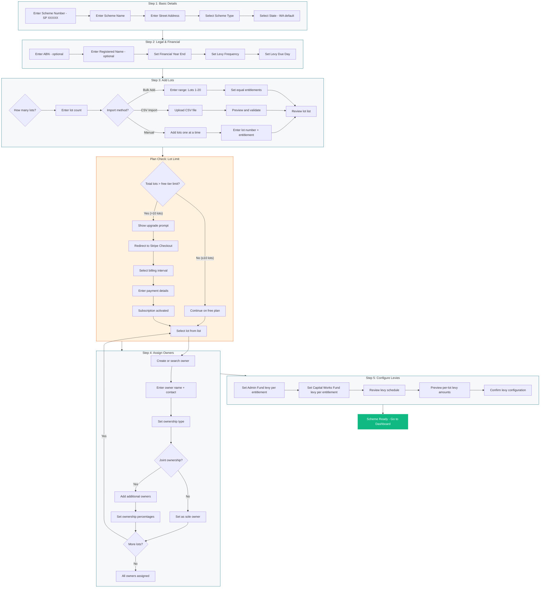
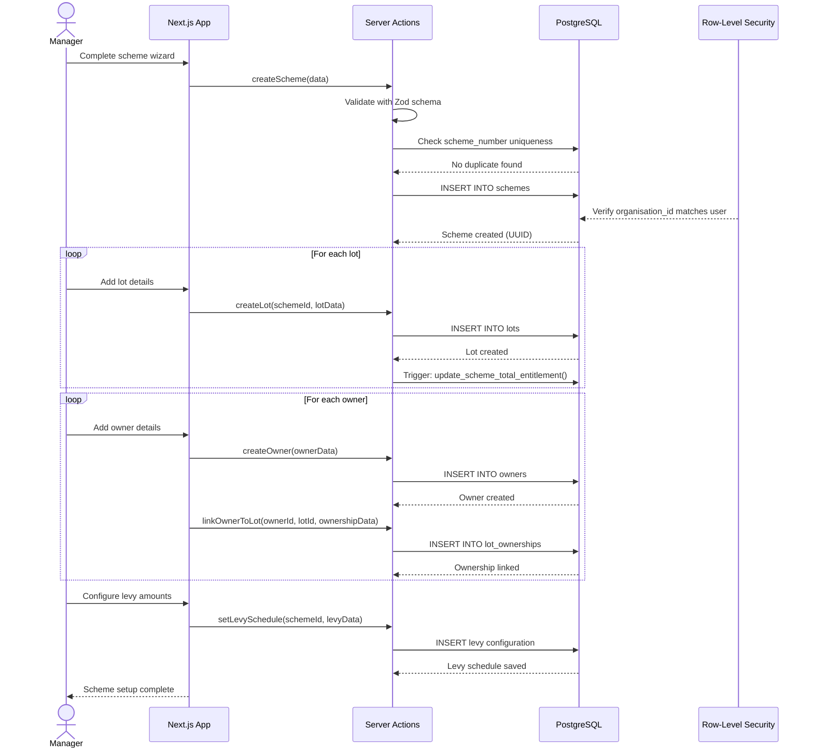

# Manager User Journeys

User journey diagrams for strata managers using LevyLite, covering onboarding, daily workflow, and scheme setup.

## 1. Manager Onboarding Journey

The end-to-end flow from first signup to sending the first levy notice. Designed for self-serve onboarding in under 30 minutes.

## 2. Manager Onboarding Flow (Detail)

Step-by-step flowchart showing the onboarding decisions and branching paths.

## 3. Manager Daily Workflow

The typical daily routine for a strata manager using LevyLite to manage their portfolio.

## 4. Daily Workflow Sequence

Technical sequence showing the manager's interaction with LevyLite systems during a typical day.

## 5. Scheme Setup Flow

Detailed flow for creating a new strata scheme with lots, owners, and levy configuration.

## 6. Scheme Setup Sequence

Server-side sequence for the scheme creation process.

