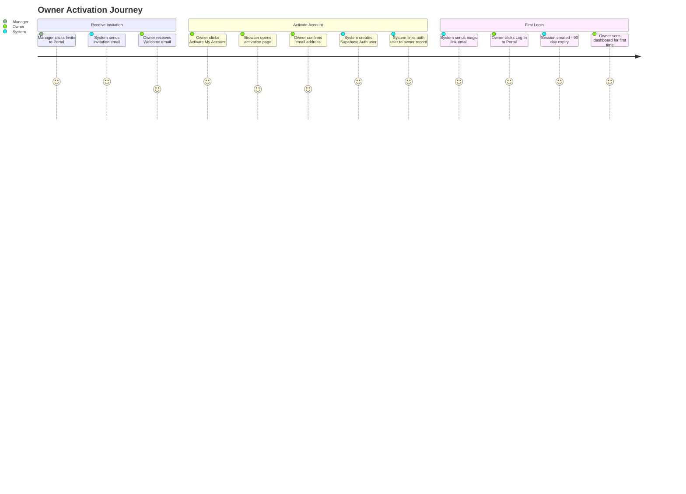
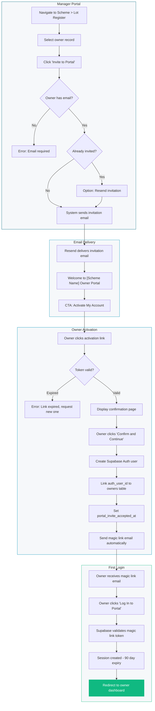
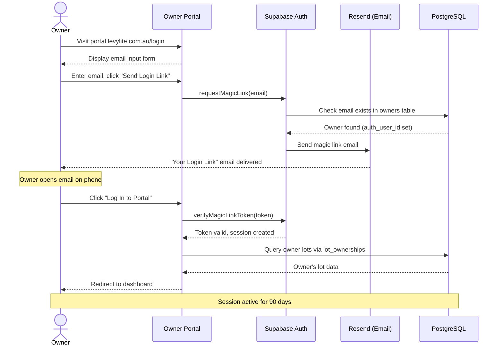
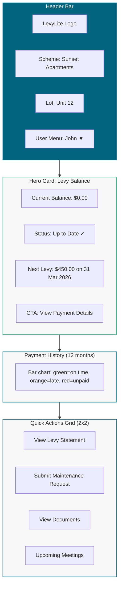
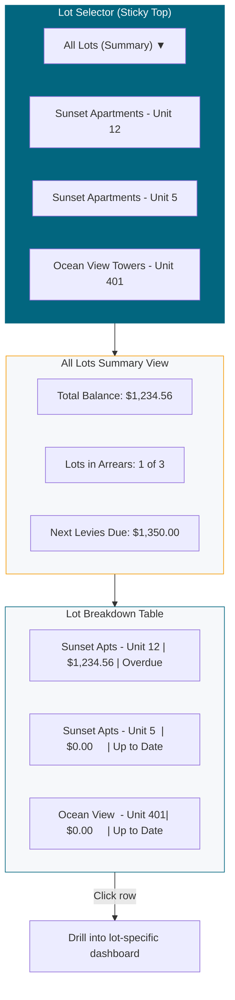
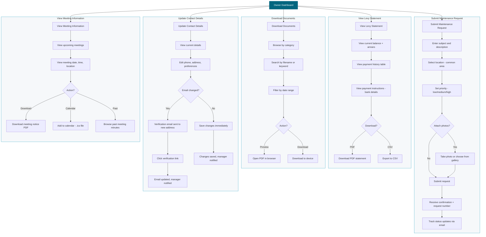
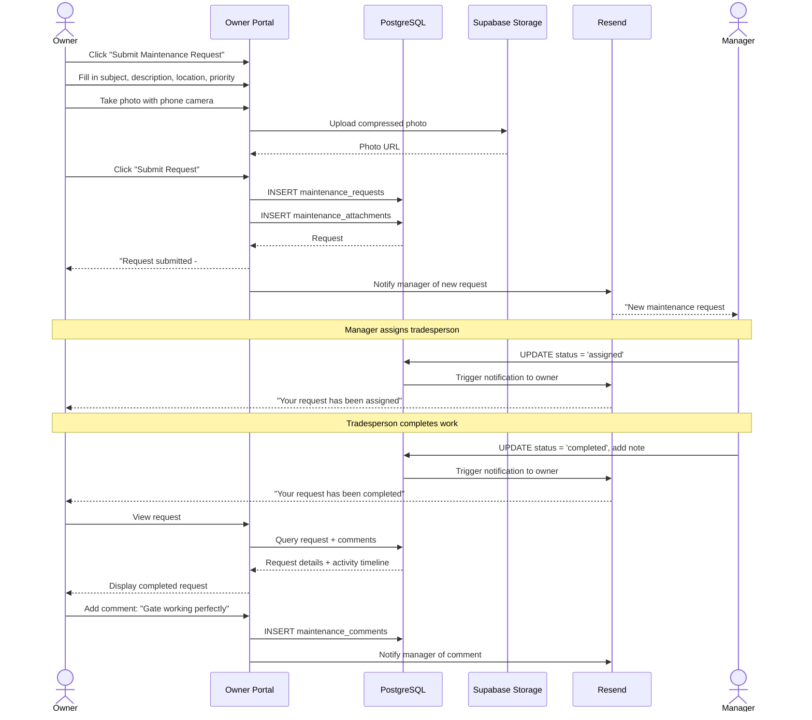
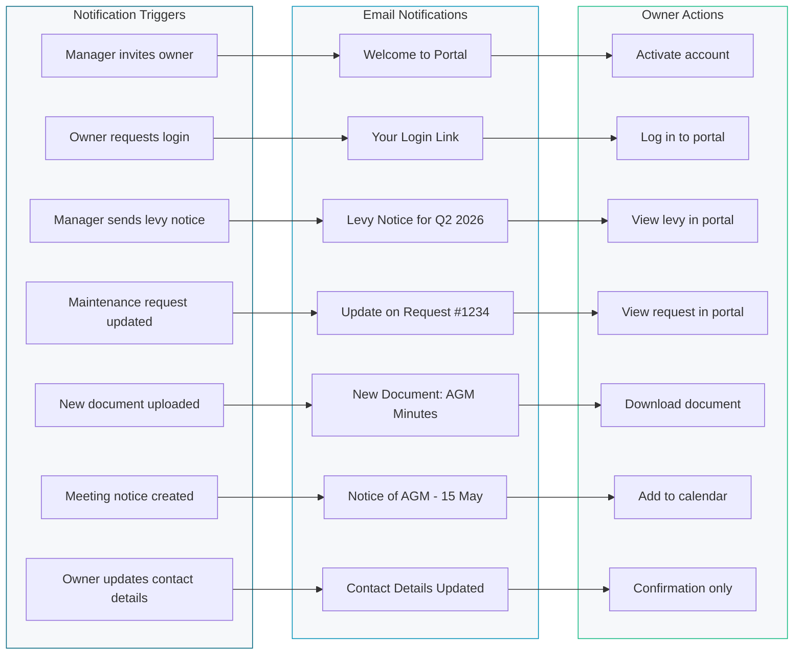

# Owner Portal Journeys

User journey diagrams for strata scheme owners accessing the self-service portal. The portal is mobile-first with passwordless (magic link) authentication.

## 1. Owner Activation Journey

The end-to-end flow from receiving an invitation email to viewing the owner dashboard for the first time.

## 2. Owner Activation Flow (Detail)

Step-by-step flowchart showing the invitation and activation process including error handling.

## 3. Returning Owner Login Flow

The magic link authentication flow for owners who already have an activated account.

## 4. Owner Dashboard Components

Visual layout showing the key components of the owner dashboard for single-lot and multi-lot owners.

## 5. Multi-Lot Owner Dashboard

Dashboard variation for owners with multiple lots across one or more schemes.

## 6. Owner Self-Service Flows

Flowchart showing all the self-service actions an owner can perform through the portal.

## 7. Maintenance Request Lifecycle (Owner Perspective)

Sequence diagram showing the full lifecycle of a maintenance request from the owner's point of view.

## 8. Owner Notification Flow

Overview of all email notifications an owner receives and their triggers.

