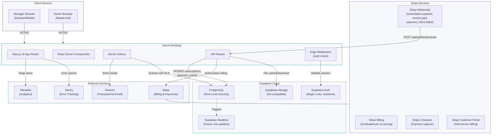
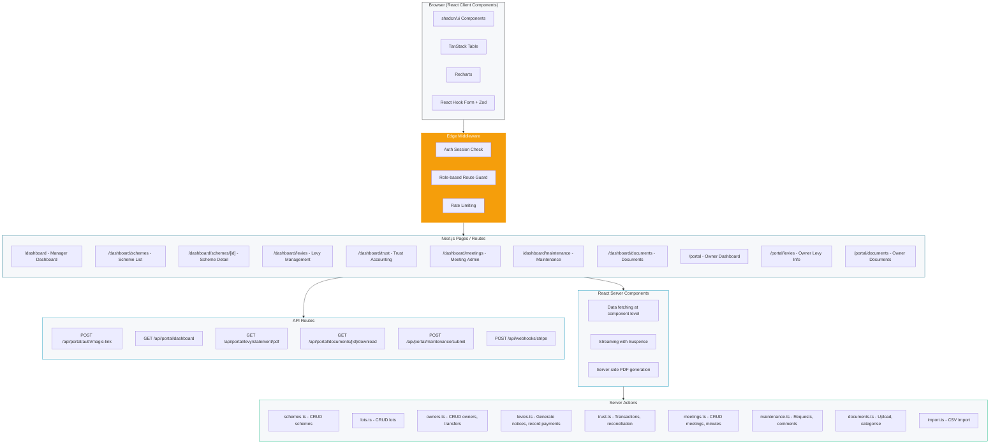
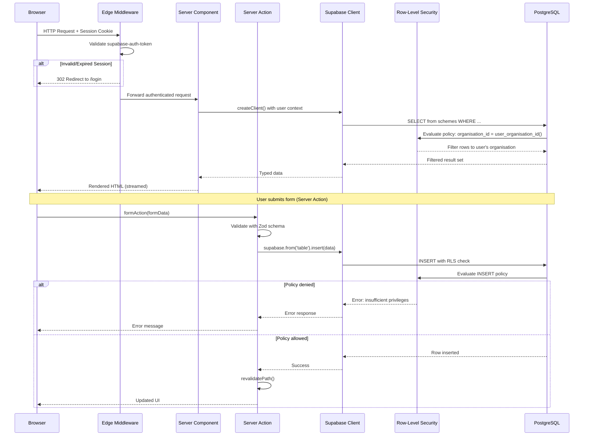
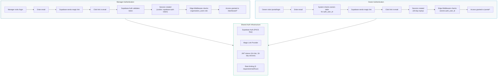
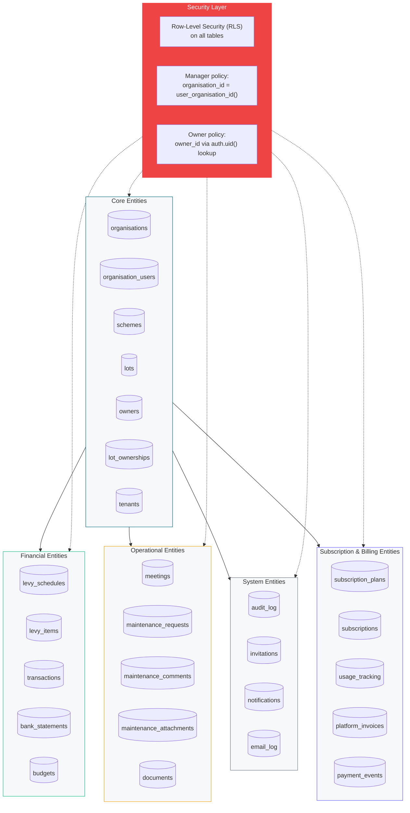
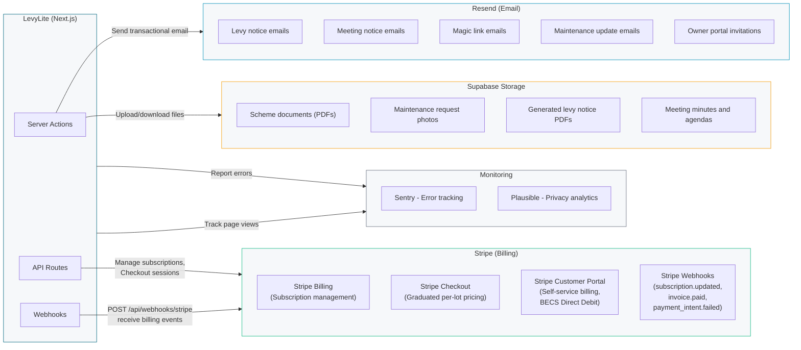
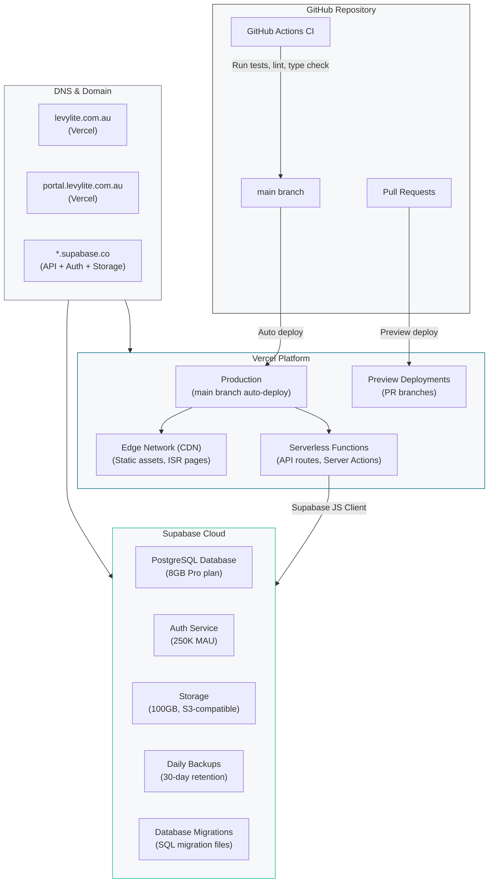
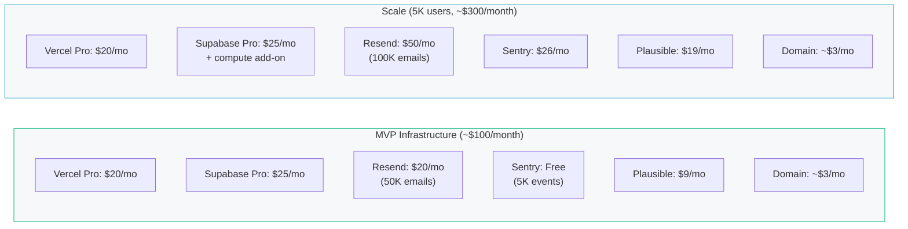

# System Architecture

Technical architecture diagrams for LevyLite covering the full stack: Next.js 15 frontend on Vercel, Supabase backend (PostgreSQL + Auth + Storage), and external service integrations.

## 1. High-Level System Architecture

Overview of the complete LevyLite tech stack and how components connect.

## 2. Application Layer Architecture

Detailed view of the Next.js 15 application structure showing pages, server components, server actions, and API routes.

## 3. Data Flow: Browser to Database (with RLS)

Sequence diagram showing how a request flows from the browser through Next.js to Supabase PostgreSQL, with Row-Level Security enforcing data isolation.

## 4. Authentication Architecture

How Supabase Auth handles both manager and owner authentication with magic links.

## 5. Database Architecture (PostgreSQL via Supabase)

High-level view of the database schema grouped by domain area, with RLS policies on every table.

## 6. External Service Integrations

How LevyLite connects to external services for email, payments, error tracking, and analytics.

## 7. Deployment Architecture

How LevyLite is deployed across Vercel and Supabase Cloud.

## 8. Infrastructure Cost Summary

