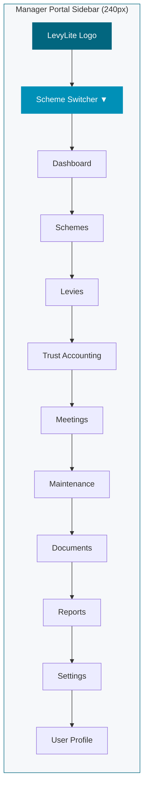
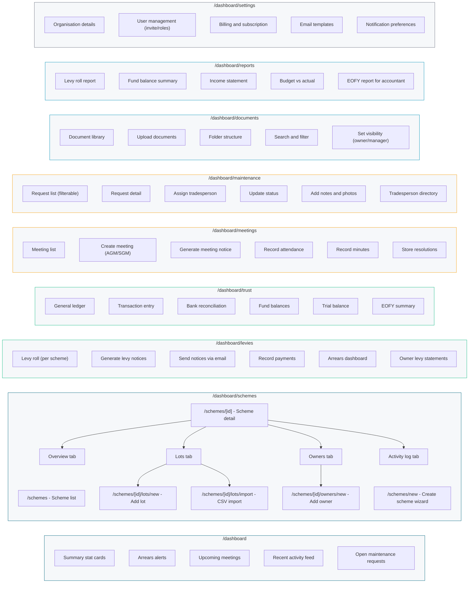
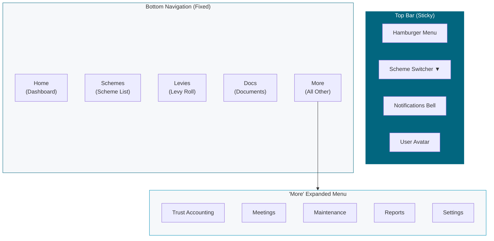
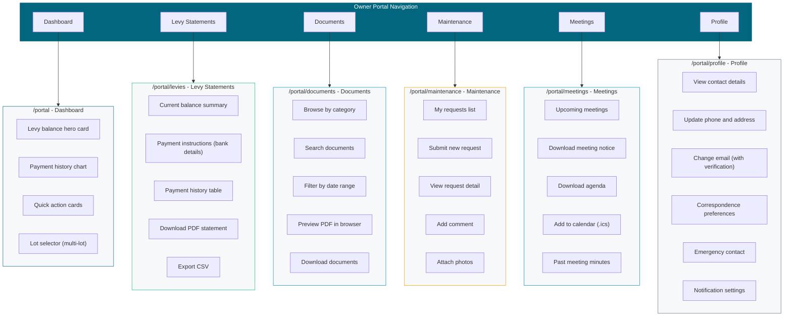
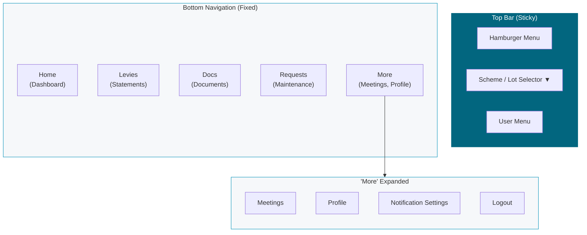
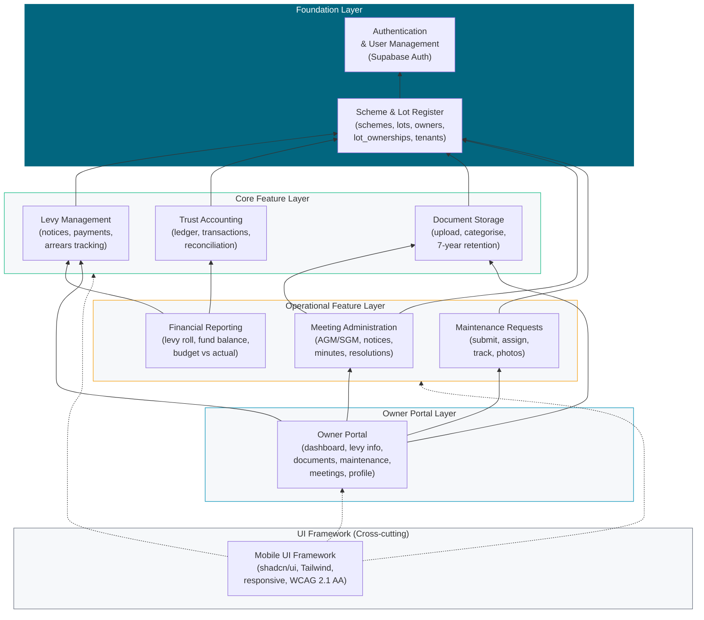
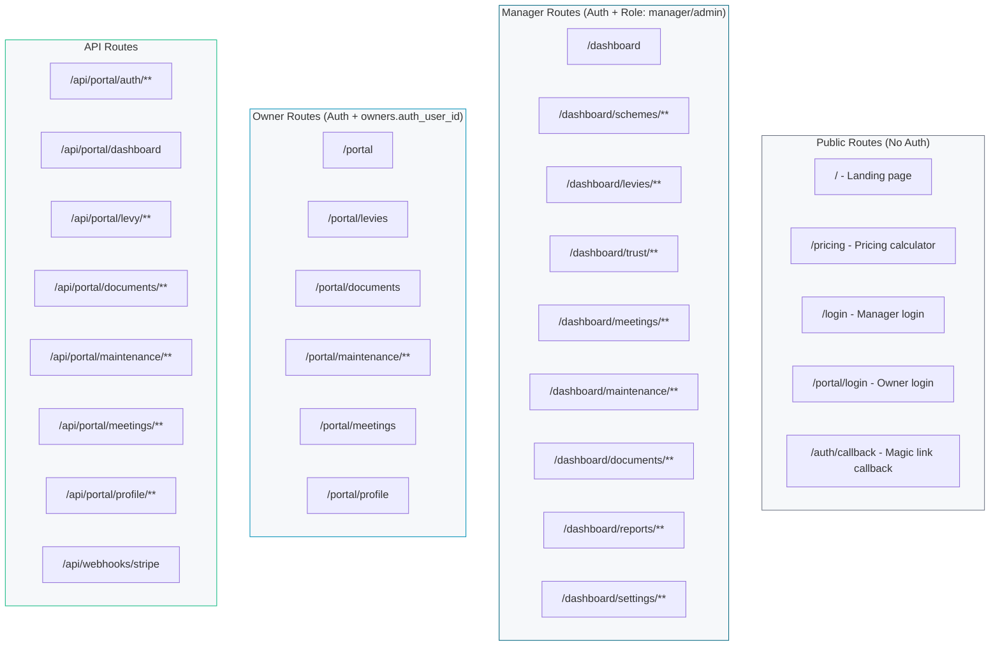
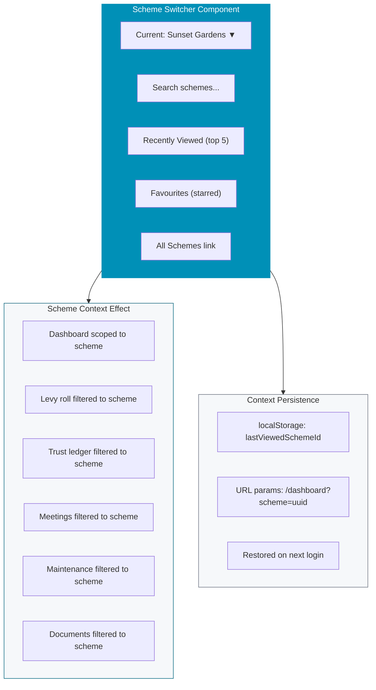
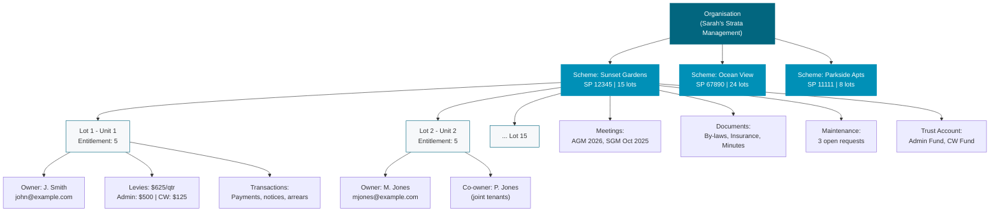

# Navigation & Information Architecture

Navigation trees and information architecture for the Manager Portal and Owner Portal, plus a feature module dependency map.

## 1. Manager Portal Navigation Tree

The full sidebar navigation structure for the manager-facing application. Available on desktop as a persistent sidebar (240px) and on mobile as a hamburger menu with bottom navigation.

## 2. Manager Portal Navigation Detail

Expanded navigation showing all sub-pages and routes.

## 3. Mobile Navigation (Manager)

Bottom navigation bar for mobile devices (viewport < 640px) with 5 primary items.

## 4. Owner Portal Navigation Tree

The navigation structure for the owner-facing self-service portal. Simplified compared to the manager portal, with focus on information consumption rather than data entry.

## 5. Mobile Navigation (Owner)

Owner portal mobile navigation. Simpler than the manager portal since there are fewer sections.

## 6. Feature Module Dependency Map

Shows how feature modules depend on each other. The Scheme & Lot Register is the foundational layer upon which all other features are built.

## 7. Route Map (Complete)

All application routes organised by portal type and access level.

## 8. Scheme Context Switching

How the scheme context switcher works across the manager portal navigation.

## 9. Information Hierarchy

The conceptual information hierarchy showing how data is structured from organisation down to individual transactions.

