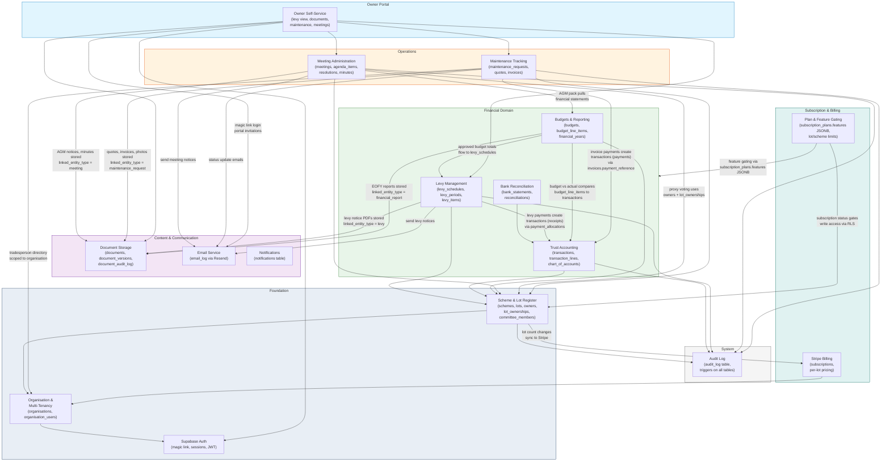
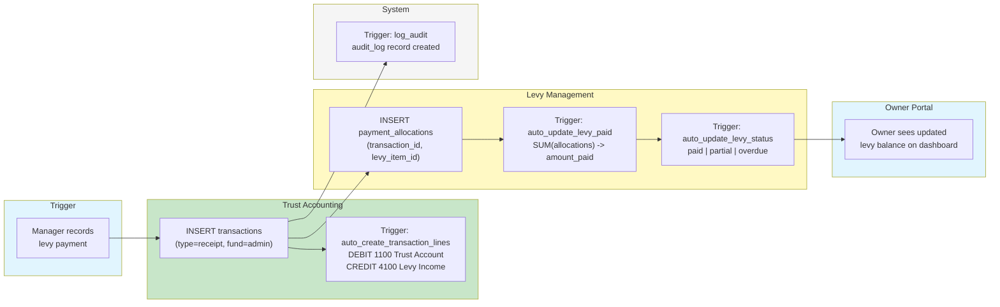
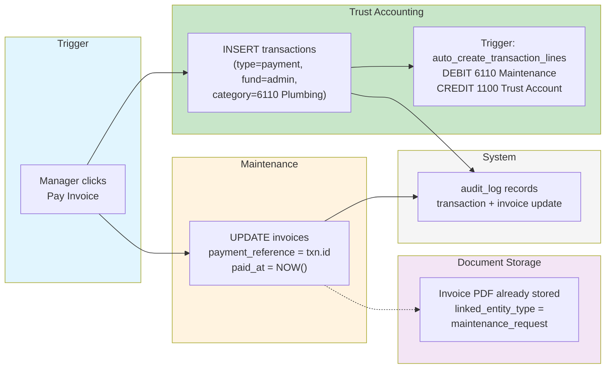
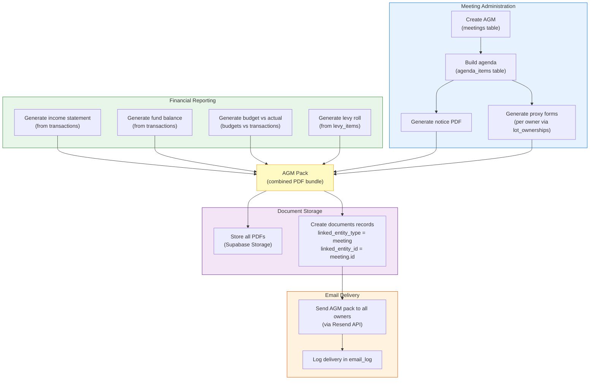
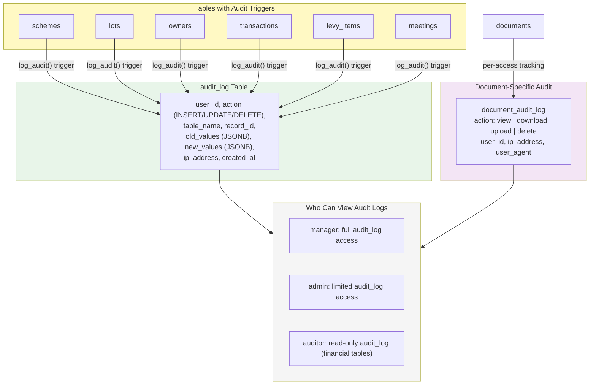
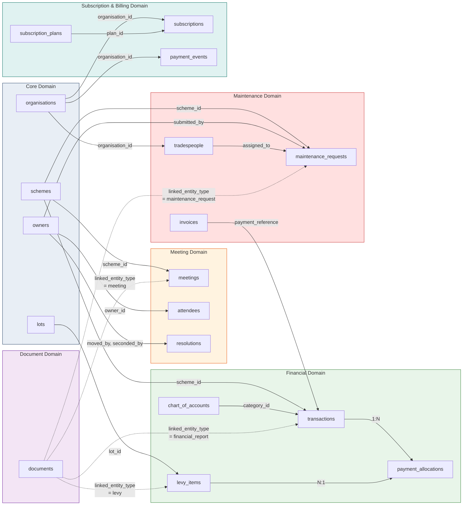

# Cross-Feature Integration Overview

High-level integration diagrams showing how all LevyLite features connect, how data flows between modules, and how shared infrastructure underpins the platform.

---

## 1. Feature Integration Map

Shows all major features and their integration points. Arrows indicate data flow direction.

---

## 2. Data Flow: Levy Payment End-to-End

Shows how a single levy payment flows through the entire system, touching levy management, trust accounting, document storage, and the owner portal.

---

## 3. Data Flow: Maintenance Invoice Payment

Shows how paying a maintenance invoice creates a trust accounting transaction and updates the maintenance record.

---

## 4. Data Flow: AGM Pack Generation

Shows how the AGM pack brings together data from meeting administration, financial reporting, and document storage.

---

## 5. Shared Infrastructure

Shows how shared Supabase services and external providers are consumed by all features.

```mermaid
flowchart TD
    subgraph supabase["Supabase Cloud"]
        SA["Supabase Auth\n(JWT, magic links, sessions)"]
        PG["PostgreSQL\n(44 tables, RLS on all)"]
        SS["Supabase Storage\n(S3-compatible, private buckets)"]
    end

    subgraph external["External Services"]
        RESEND["Resend\n(transactional email)"]
        STRIPE["Stripe\n(subscription billing)"]
        SENTRY["Sentry\n(error tracking)"]
    end

    subgraph consumers["Feature Consumers"]
        direction LR
        C1["Auth & Login"]
        C2["Scheme Register"]
        C3["Levy Management"]
        C4["Trust Accounting"]
        C5["Meeting Admin"]
        C6["Maintenance"]
        C7["Document Storage"]
        C8["Owner Portal"]
        C9["Billing"]
    end

    SA -->|"auth.uid() in every query"| C1
    SA -->|"magic link login"| C8

    PG -->|"RLS-filtered queries"| C2
    PG -->|"RLS-filtered queries"| C3
    PG -->|"RLS-filtered queries"| C4
    PG -->|"RLS-filtered queries"| C5
    PG -->|"RLS-filtered queries"| C6
    PG -->|"RLS-filtered queries"| C7
    PG -->|"RLS-filtered queries"| C8

    SS -->|"document files"| C7
    SS -->|"levy notice PDFs"| C3
    SS -->|"maintenance photos"| C6
    SS -->|"meeting documents"| C5

    RESEND -->|"levy notices"| C3
    RESEND -->|"meeting notices"| C5
    RESEND -->|"status updates"| C6
    RESEND -->|"portal invitations"| C8

    STRIPE -->|"subscription management"| C9

    SENTRY -->|"error reports"| consumers

    style supabase fill:#e8f5e9,stroke:#2e7d32
    style external fill:#f5f5f5,stroke:#616161
    style consumers fill:#e1f5fe,stroke:#0277bd
```

---

## 6. Audit Trail Coverage

Shows which tables have audit triggers and how all critical actions are captured in the `audit_log` table.

---

## 7. Cross-Feature Entity Relationship Summary

Shows key cross-domain foreign key relationships that connect feature areas.

