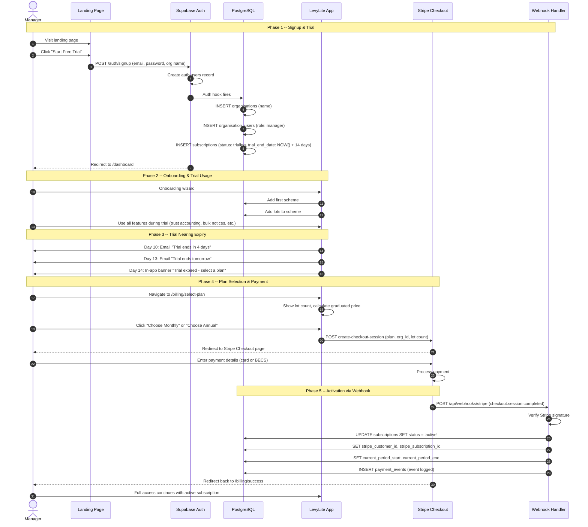
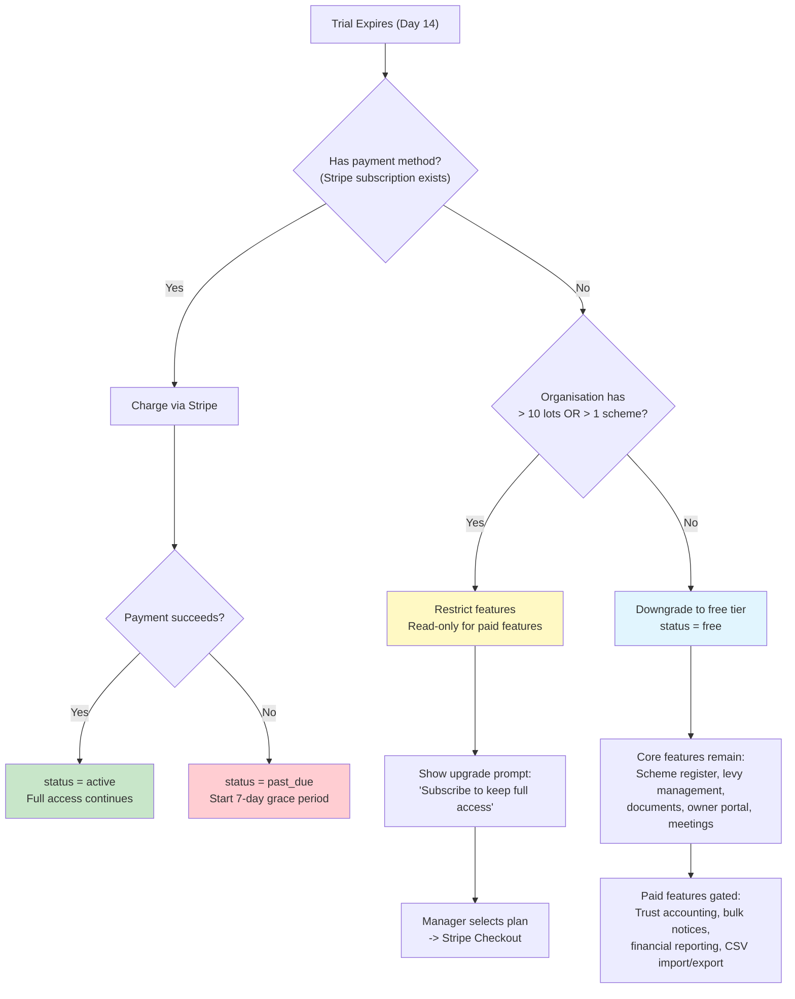
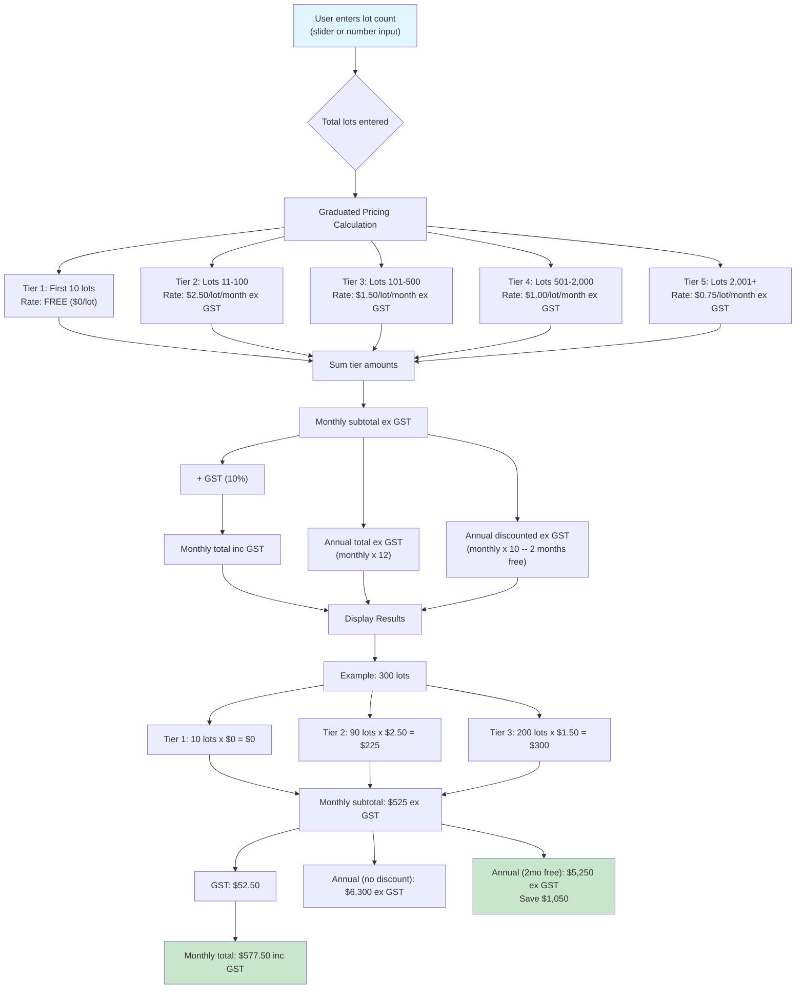

# Signup & Onboarding Diagrams

Covers the full signup flow from landing page through trial, the trial expiry decision tree, and the pricing calculator logic.

---

## 1. Signup & Subscription Onboarding (Sequence Diagram)

Full flow from landing page visit through to an active paid subscription.

---

## 2. Trial Expiry Decision Tree (Flowchart)

What happens when the 14-day trial expires, depending on the organisation's lot count and payment status.

---

## 3. Pricing Calculator (Flowchart)

Interactive pricing calculator logic used on the landing page and billing settings. Shows graduated pricing calculation with a concrete example.

