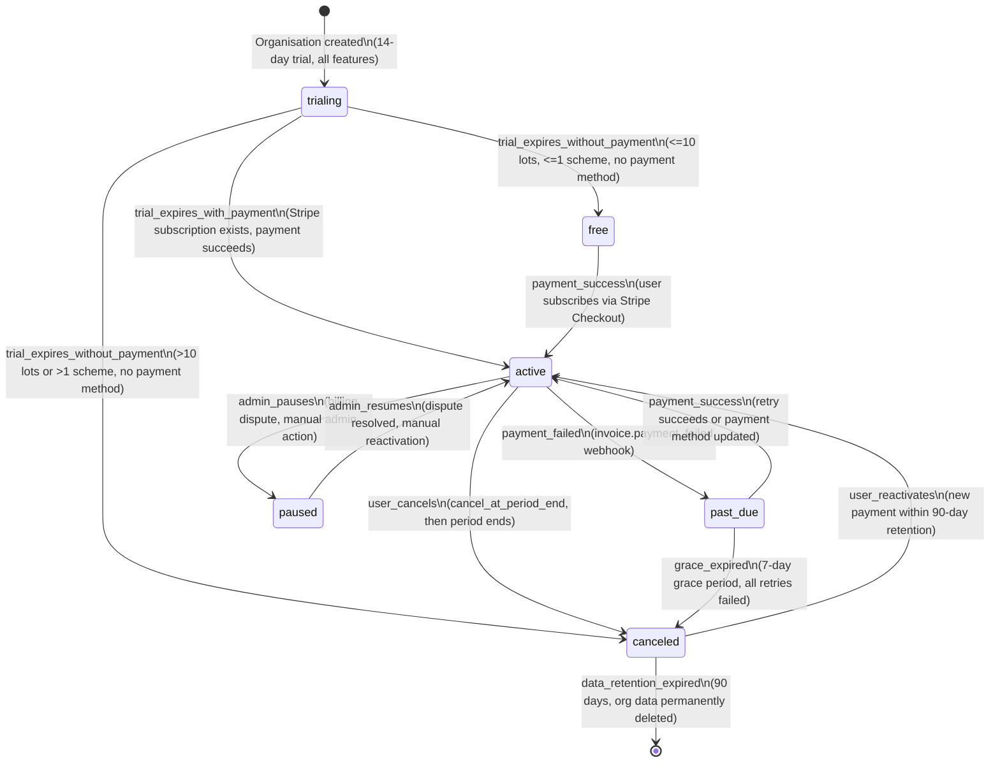
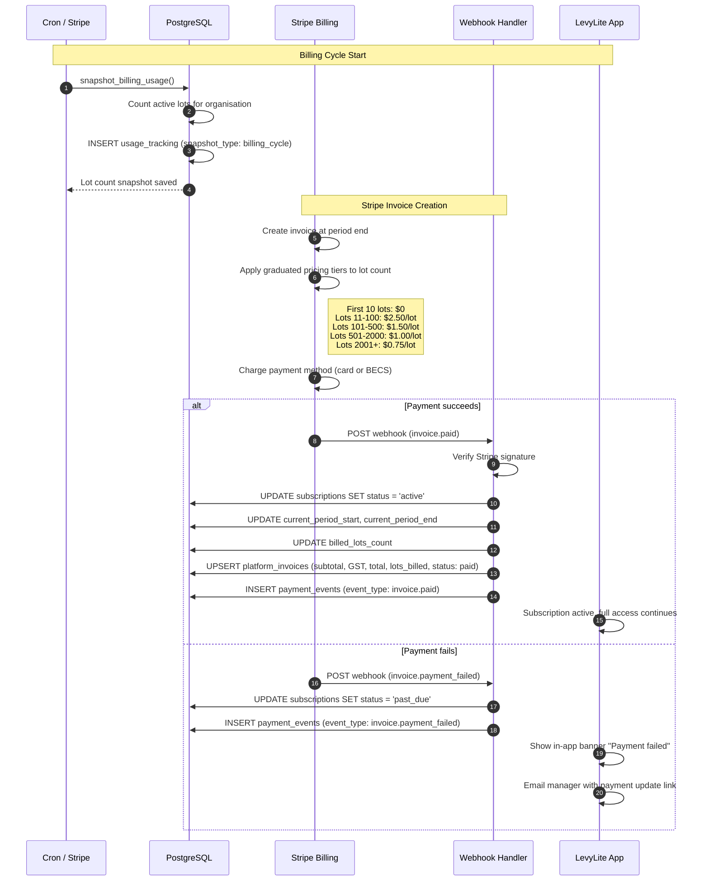
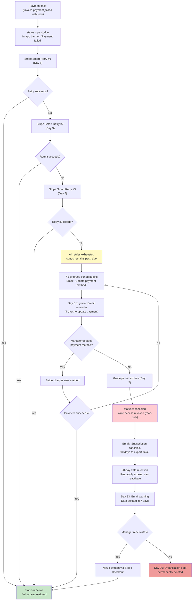

# Billing Lifecycle Diagrams

Covers subscription state transitions, monthly billing cycle, and the failed payment dunning process.

---

## 1. Subscription State Diagram

All subscription states and their transitions, driven by payment events, trial expiry, and user actions.

---

## 2. Monthly Billing Cycle (Sequence Diagram)

How a recurring billing cycle works: lot count snapshot, graduated price calculation, Stripe invoice, and subscription update.

---

## 3. Failed Payment Dunning Process (Flowchart)

What happens when a recurring payment fails, including Stripe Smart Retries, grace period, and eventual data retention/purge.

