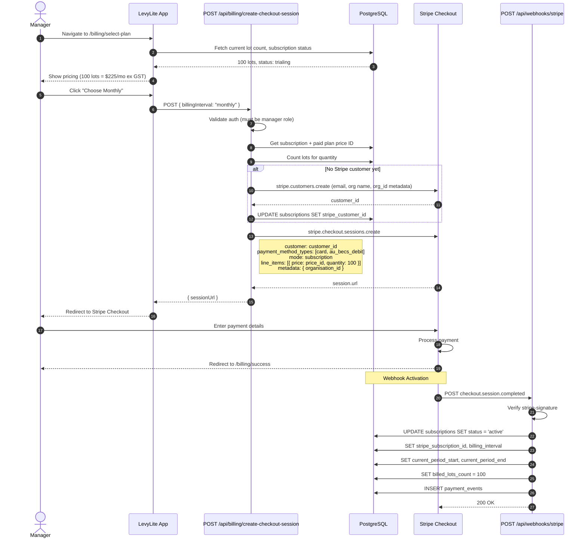
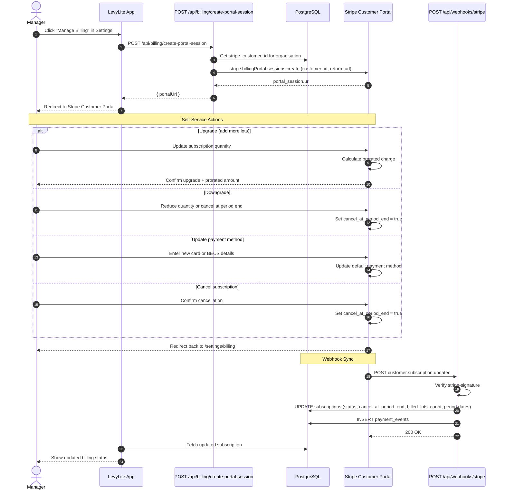
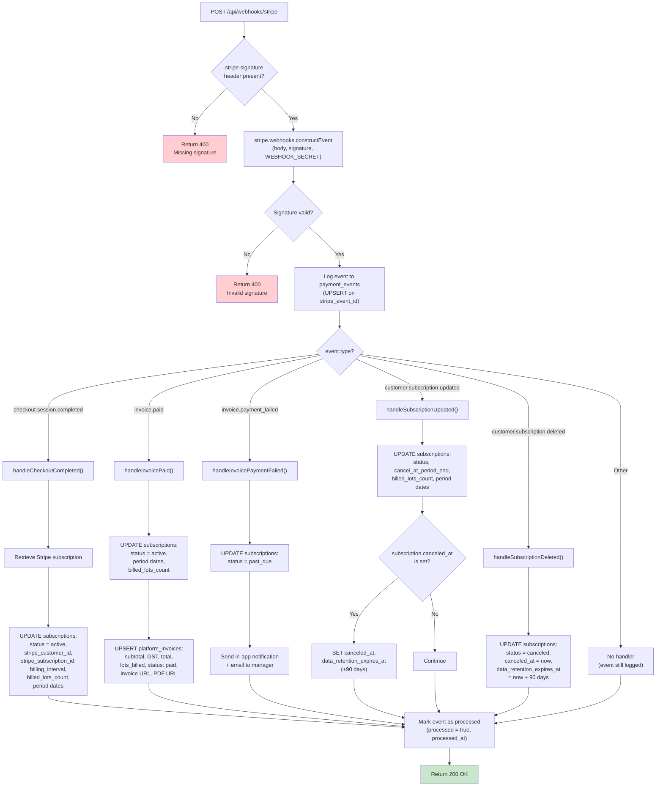

# Stripe Integration Diagrams

Covers Stripe Checkout flow, Customer Portal integration, webhook event handling, and BECS Direct Debit payment flow.

---

## 1. Stripe Checkout Flow (Sequence Diagram)

Initial subscription creation via Stripe Checkout, from plan selection through payment to subscription activation.



---

## 2. Stripe Customer Portal (Sequence Diagram)

Self-service billing management via Stripe's hosted Customer Portal. Handles upgrades, downgrades, cancellations, and payment method updates.



---

## 3. Webhook Event Handler (Flowchart)

How incoming Stripe webhook events are verified, routed, processed, and logged.



---

## 4. BECS Direct Debit Flow (Flowchart)

Australian BECS Direct Debit payment flow via Stripe, showing the mandate creation and delayed settlement process.

```mermaid
flowchart TD
    A["Customer reaches Stripe Checkout"] --> B{"Select payment method"}

    B -->|Credit/Debit Card| C["Enter card details"]
    C --> D["Stripe charges card<br/>(instant settlement)"]
    D --> E["checkout.session.completed<br/>webhook fires immediately"]

    B -->|BECS Direct Debit| F["Enter BSB + Account Number"]
    F --> G["Customer accepts<br/>Direct Debit Request (DDR)<br/>service agreement"]
    G --> H["Stripe creates mandate<br/>(authorisation to debit account)"]
    H --> I["Stripe initiates debit<br/>(via BECS clearing system)"]
    I --> J["3-5 business day<br/>settlement period"]
    J --> K{"Debit succeeds?"}

    K -->|Yes| L["invoice.paid webhook fires"]
    L --> M["status = active<br/>Subscription confirmed"]

    K -->|No| N["invoice.payment_failed<br/>webhook fires"]
    N --> O["Possible reasons:<br/>- Insufficient funds<br/>- Invalid account<br/>- Mandate revoked"]
    O --> P["status = past_due<br/>Dunning process begins"]

    E --> Q["status = active<br/>Subscription confirmed"]

    Note over F,G: BECS fees: ~1% + A$0.30<br/>capped at A$3.50 per transaction

    style Q fill:#c8e6c9
    style M fill:#c8e6c9
    style P fill:#ffcdd2
```
