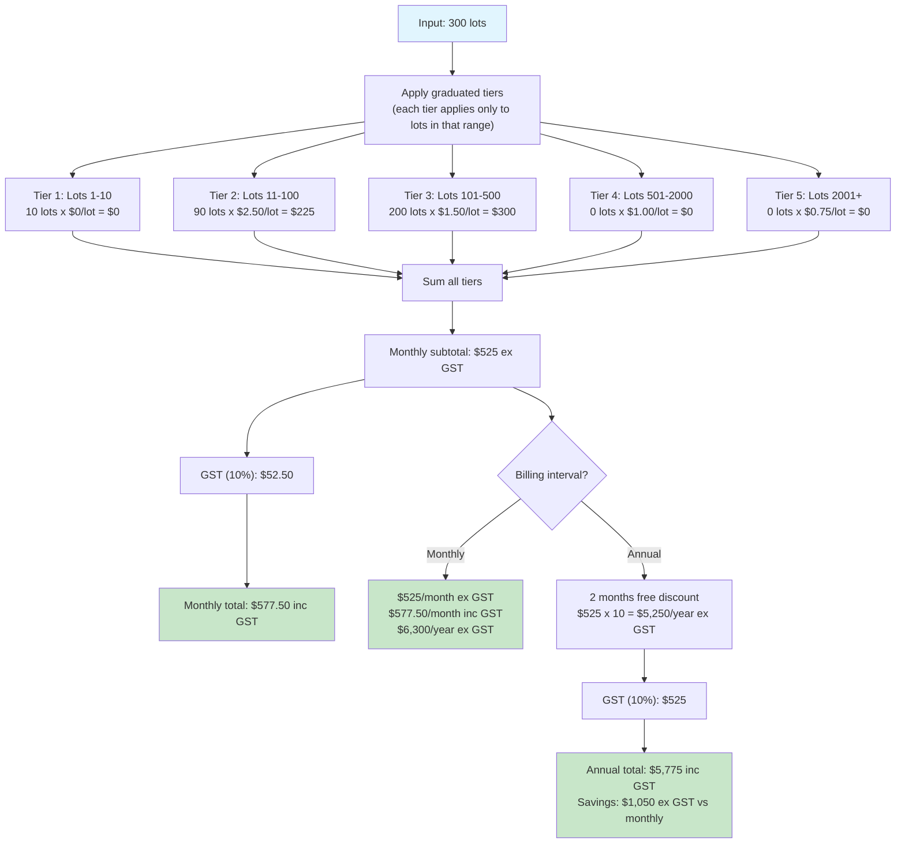
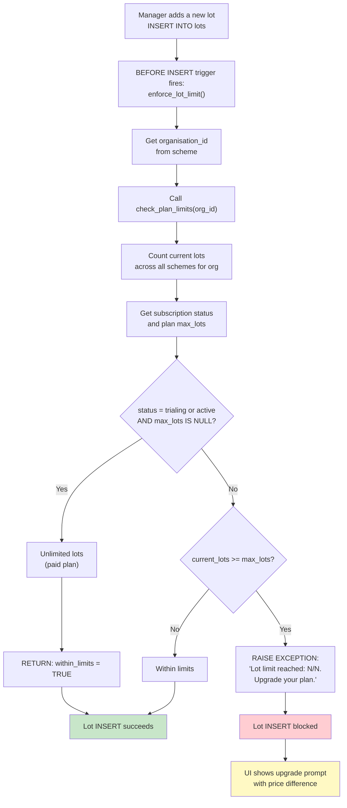
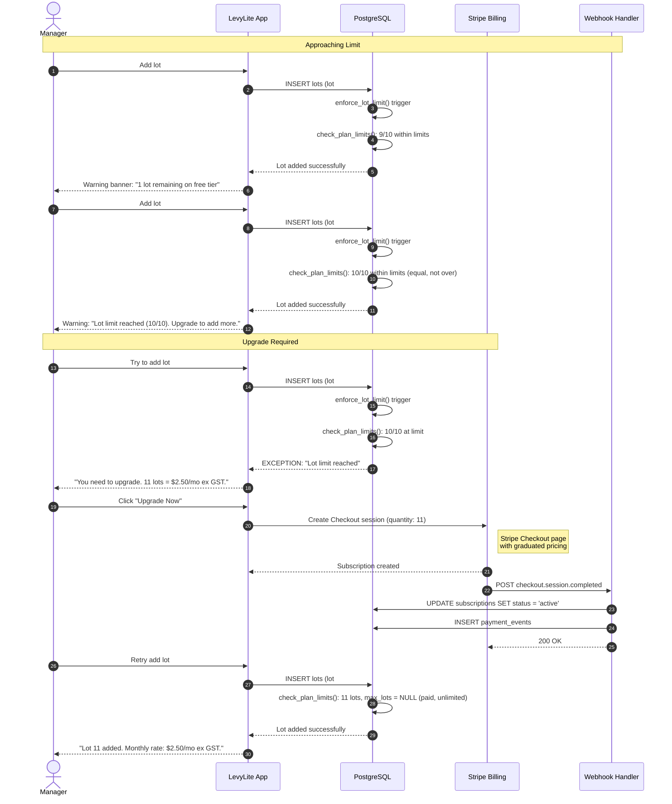
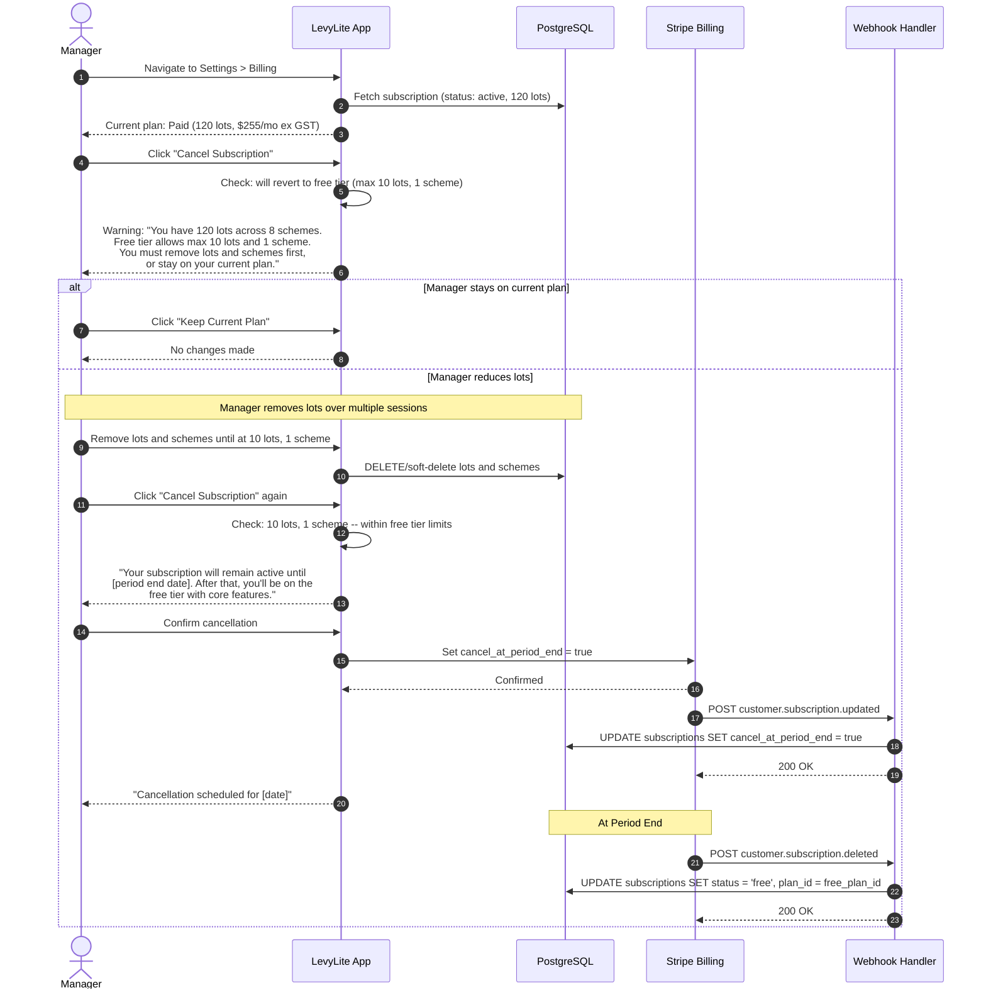
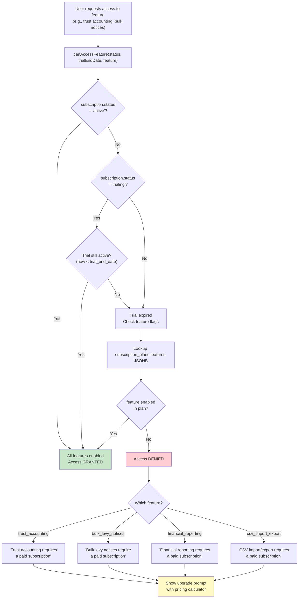

# Plan Limits & Graduated Pricing Diagrams

Covers graduated pricing calculation, plan limit enforcement, upgrade flow, downgrade flow, and feature gating.

---

## 1. Graduated Pricing Calculation (Flowchart)

How the graduated pricing model works, with a concrete example for 300 lots.

---

## 2. Plan Limit Enforcement (Flowchart)

Database-level enforcement when a manager adds a lot. A trigger fires `check_plan_limits()` to validate the lot count against the subscription plan.

---

## 3. Upgrade Flow (Sequence Diagram)

What happens when a free-tier manager reaches the 10-lot limit, triggering an upgrade to a paid plan.

---

## 4. Downgrade Flow (Sequence Diagram)

What happens when a manager on a paid plan attempts to cancel and revert to the free tier. Lots must be within the free tier limits (10 lots, 1 scheme) before the downgrade can proceed.

---

## 5. Feature Gating (Flowchart)

How access to paid-only features is controlled via the `subscription_plans.features` JSONB column.

